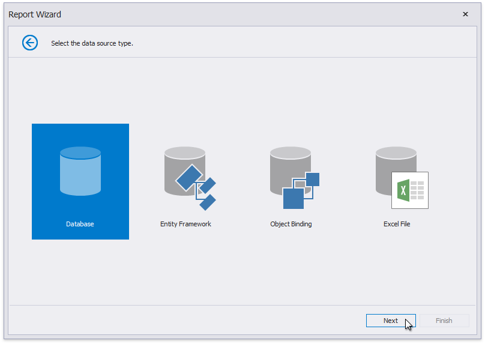

# Select the Data Source Type
> [!NOTE]
> This wizard step appears only if you're creating a new report from scratch. In this instance, familiarity with data source connections is required, so we recommend that you contact your application administrator or vendor for assistance. If you're modifying an existing report, this step will not appear and you will start with [Choose Fields to Display in a Report](choose-fields-to-display-in-a-report.md).

This wizard page allows you to select the required data source type.

Click **Next** to proceed to the next wizard page, depending on the selected data source type.
* [Connect to a Database](connect-to-a-database.md)
* [Connect to an Entity Framework Data Source](connect-to-an-entity-framework-data-source.md)
* [Connect to an Object Data Source](connect-to-an-object-data-source.md)
* [Connect to an Excel Data Source](connect-to-an-excel-data-source.md)