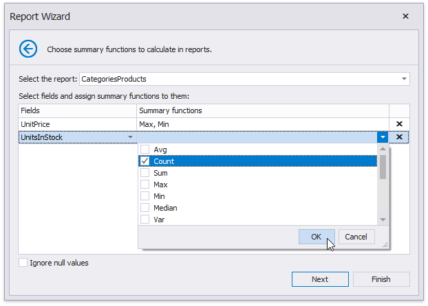
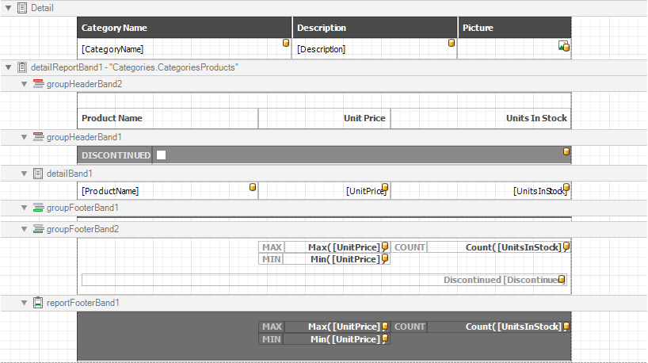

# Specify Summary Options

> [!NOTE]
> This wizard step is only available if you have applied data grouping in the previous step ([Add Grouping Levels](add-grouping-levels.md)). If you have not grouped data, this step is skipped.

On this wizard page, you can specify summaries to calculate in the selected reports.

Use the drop-down list at the top of the wizard page to choose a required report.

In the **Fields** table column, you can select an available numerical or date-time field. To specify which functions should be calculated for the selected field, enable the corresponding check boxes in the **Summary functions** drop-down.

The specified summaries are displayed in the report footer and after corresponding groups (if you have grouped report data on the [previous wizard page](add-grouping-levels.md)).

If data fields can contain empty values and you do not want to take these values into account when calculating totals, select the **Ignore null values** check box. Otherwise, these values are treated as zeros for numeric fields and the earliest system date for date-time fields.

You can stop the wizard at this step by clicking **Finish**. The created report looks similar to the image below.

If you want to customize the report further, click **Next** to proceed to the next wizard page: [Set the Report Title](set-the-report-title.md).