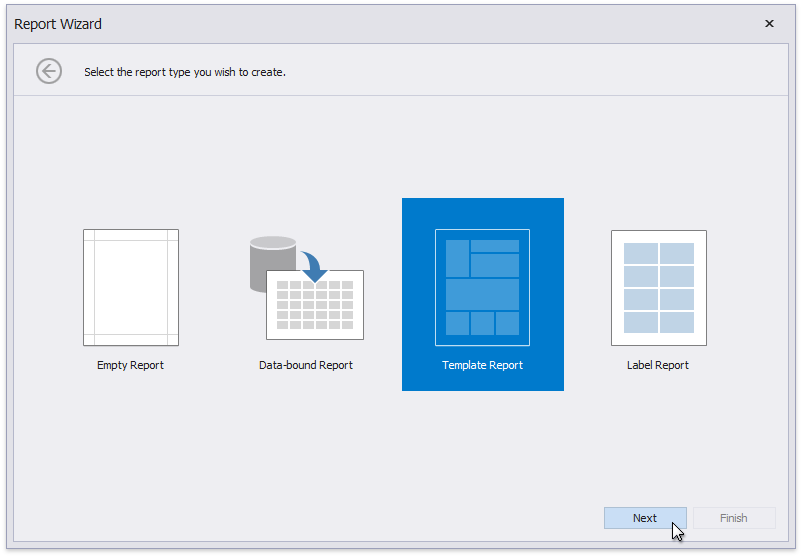

# Template Report

The topics in this section describe how to create a new report based on available predefined templates.

[Run the Report Wizard](..\report-wizard.md) and select the **Template Report** option on its first page.

Template report creation includes the following steps.

* [Choose a Report Template](template-report\choose-a-report-template.md)
* [Map Report Template Fields](template-report\map-report-template-fields.md)
* [Specify Report Template Options](template-report\specify-report-template-options.md)