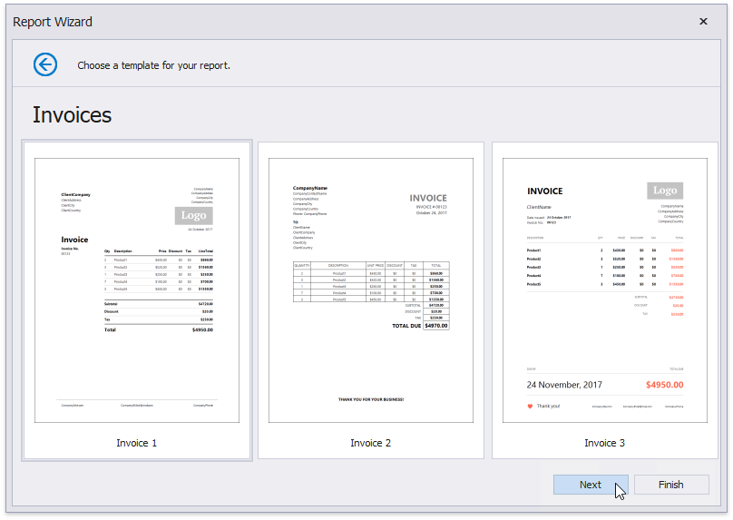

# Choose a Report Template

This wizard page allows you to choose one of the predefined report layouts.

Once the wizard finishes, the selected template defines the arrangement of the appropriate elements in a report and their appearance settings. You can stop the wizard on this page by clicking **Finish**.

Click **Next** to provide data to your report and continue report customization.

The next couple of pages guide you through the data source setup. See topics in the [Data-bound Report](..\data-bound-report.md) section for detailed information.

After you configured a data source, proceed to the following wizard page: [Map Report Template Fields](map-report-template-fields.md).