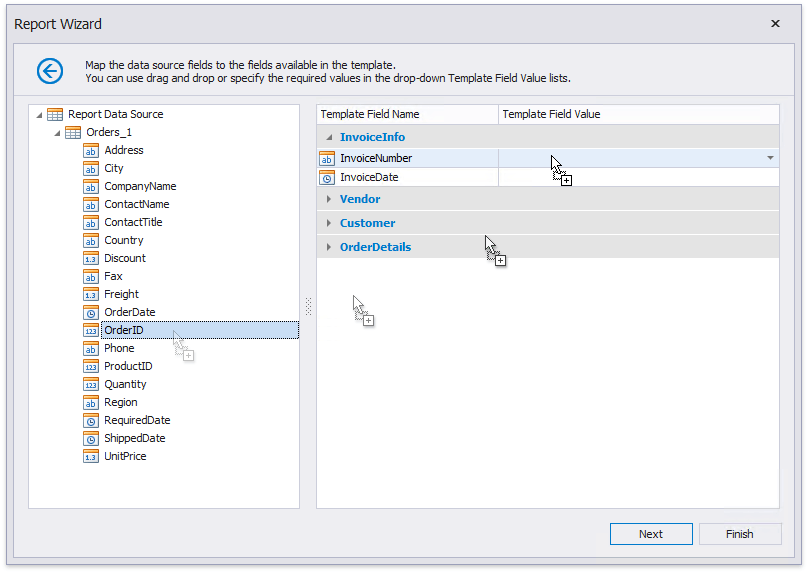
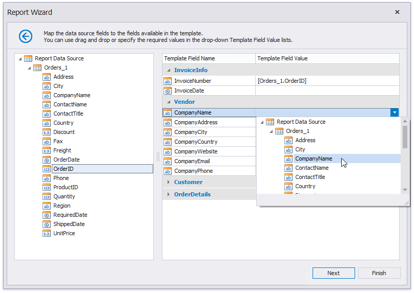

# Map Report Template Fields

On this wizard page, you can specify the relationships between the data source's fields and predefined template fields, or provide static values for the template fields.

The tree on the left-hand side displays data source fields. The grid on the right-hand side contains two columns with available template fields and their values divided into categories.

Drag and drop the required data field from the tree onto the corresponding template field to map these fields.

You can also select the necessary data field from the **Template Field Value** drop-down list.

Select **None** in the drop-down list to delete a mapping.

You can also manually enter a static field value in the **Template Field Value** column.

If you do not provide values to specific template fields, the corresponding elements are added to the resulting report anyway.

You can stop the wizard at this step by clicking **Finish** or click **Next** to proceed to the following wizard page: [Specify Report Template Options](specify-report-template-options.md).