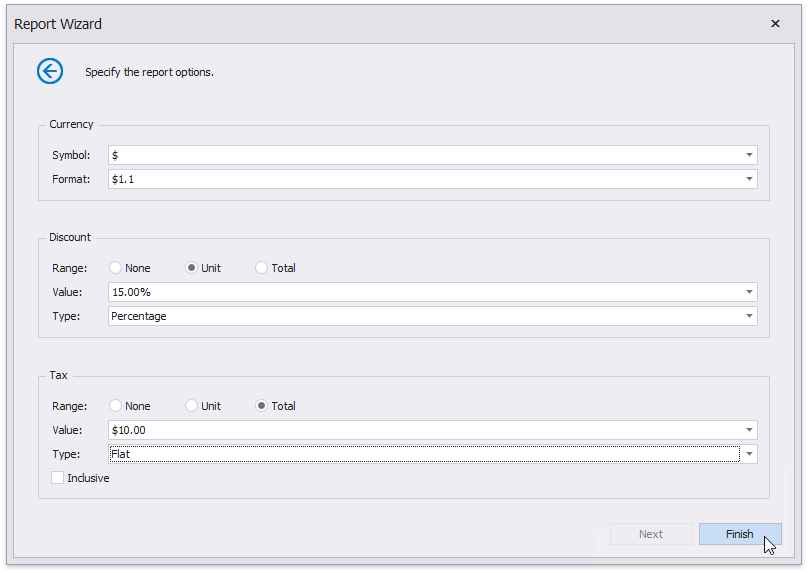

# Specify Report Template Options

The following wizard page allows you to specify currency formatting options and the discount/tax options.

In the **Currency** section, select the currency symbol and format for displaying price values.

In the **Discount** and **Tax** section, you can specify the following settings.

* **Range** - Defines whether the discount/tax value should not be taken into account (**None**), or should be used for individual items (**Unit**) or for the entire order (**Total**).
* **Value** - Specifies the discount/tax value that can be static or bound to the data source field.
* **Type** - Specifies the type of the discount/tax value (flat, fixed or percentage).
* **Inclusive** (for the tax only) - Indicates whether the tax value is included into product prices.

Click **Finish** to complete the wizard and get the resulting report.