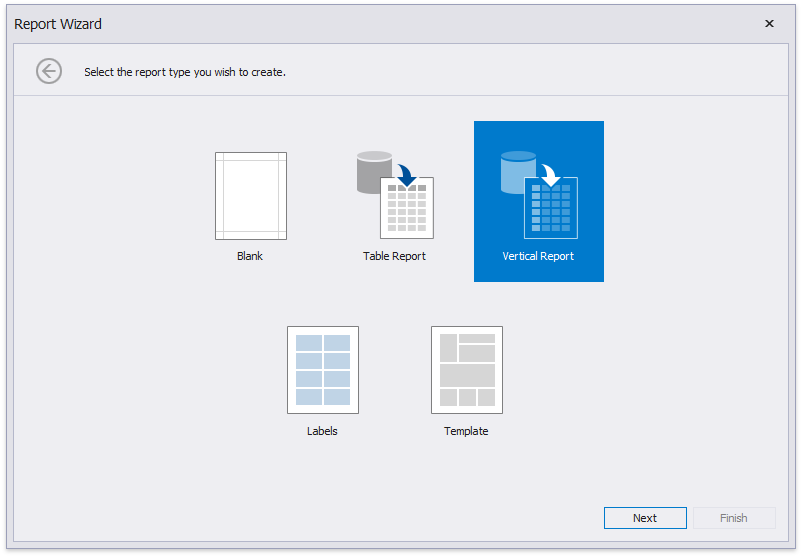

# Vertical Report

The topics in this section describe how to create a [vertical report](../../create-reports/vertical-reports.md) - a table report where record fields are displayed vertically and data records are printed horizontally.

[Run the Report Wizard](../report-wizard.md) and select **Vertical Report** to create a new vertical report and connect it to data.

The Report Wizard can include the following pages (similar to the Table Report type):

* [Select the Data Source Type](table-report\select-the-data-source-type.md)
* [Choose Fields to Display in a Report](table-report\choose-fields-to-display-in-a-report.md)
* [Add Grouping Levels](table-report\add-grouping-levels.md)
* [Specify Summary Options](table-report\specify-summary-options.md)
* [Specify Report Page Settings](table-report\specify-report-page-settings.md)
* [Specify a Report Color Scheme](table-report\choose-a-report-color-scheme.md)
* [Set the Report Title](table-report\set-the-report-title.md)

After you finish the wizard, it creates a report with [vertical bands](../../introduction-to-banded-reports.md#vertical-bands): **Vertical Header**, **Vertical Detail** and **Vertical Total**.

