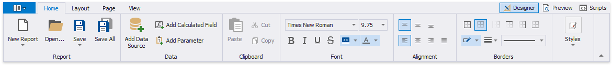
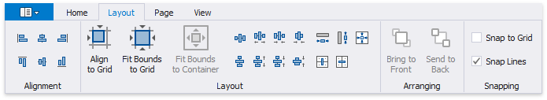
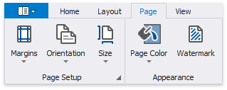
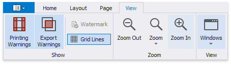
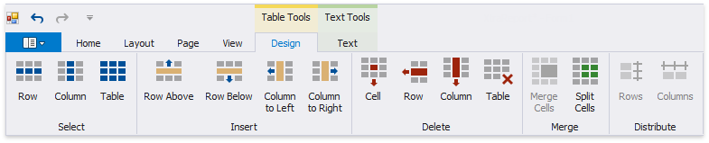

# Toolbar

The Report Designer **Toolbar** includes the **Home**, **Layout**, **Page**, and **View** tabs for general commands as well as contextual tabs for commands relating to the selected report controls. 

## Home Tab

Use commands in this tab to

* add new reports, load and save report layouts;
* add data sources, [calculated fields](..\shape-report-data\use-calculated-fields.md), and [report parameters](..\shape-report-data\use-report-parameters\parameters-overview.md);
* delete the selected report elements, place them on the clipboard and paste them onto report bands;
* customize font, color, formatting and alignment settings;
* create new styles based on the selected control's appearance settings and then apply the created styles to other controls.

## Layout Tab

This tab provides commands that

* align report elements to each other or the snap grid;
* change the report element size relative to other report elements and to fit the snap grid or the parent container;
* change the stacked elements' order;
* select the snapping mode.

## Page Tab

These commands allow you to

* set the page margins, orientation, and paper size;
* specify the page's background color;
* add watermark text to a report or turn a picture into a report's background.

## View Tab

This tab enables you to

* turn on/off [export and printing warnings](..\use-report-elements\manipulate-report-elements.md) to highlight intersecting controls and controls placed outside page margins;
* display the document's watermark on the design surface;
* specify whether to draw the snap grid;
* zoom the design surface;
* manage the Report Designer panels' visibility.

## Contextual Tabs

Contextual tabs are visible whenever you select a specific report element and provide commands applicable to the selected element's type. 

The following image demonstrates the table cell's available tabs:

