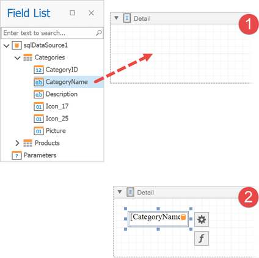

# Field List

This panel displays the schema of a report's data sources. You can right-click a data source item to access its settings. For example, you can add a data source to the [Report Gallery](report-gallery.md) to later re-use it in other reports.

The Field List enables you to perform the following actions.

## Bind controls to data

Dropping a field onto a report's surface creates a new report control bound to a corresponding field.

Dropping a field onto an existing control binds this control to a corresponding field.

You can preserve data bindings of an existing control by holding down the CTRL key when dropping a data field on this control. This creates a new report control on top of the existing control.

## Create specific controls

To create a data-bound control of a specific type, do any of the following:

* Hold down the SHIFT key and drop a data field onto a report's surface.
* Right-click a corresponding data field and drop it onto a report's surface.

This invokes a context menu enabling you to select which control to create.

## Create tables

Dropping an entire data table onto a report creates a table with its columns bound to fields contained in the data table.

To select multiple fields, click them with holding the CTRL or SHIFT key. Dropping these fields onto a report creates a new table with its cells bound to the corresponding fields.

To create column headers, right-click the required fields with holding the CTRL or SHIFT key and drop them onto a report surface. This creates a new table with its cells displaying the field names.

## Data shaping operations

In addition, the Field List can help you solve the following tasks:

* Add [calculated fields](../../shape-report-data/use-calculated-fields/calculated-fields-overview.md) to data columns for performing various calculations in a report.
	
	
* Manage the collection of [report parameters](../../shape-report-data/use-report-parameters.md).
	
	