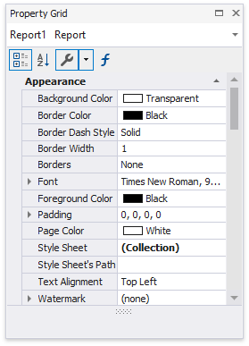
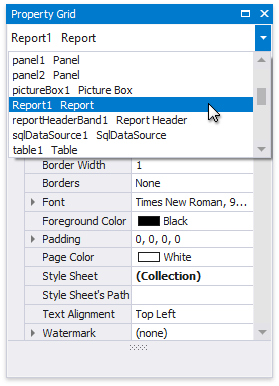
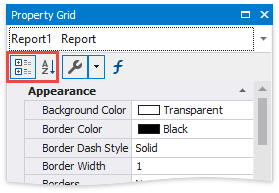
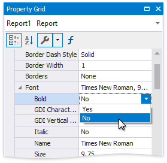
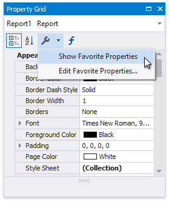
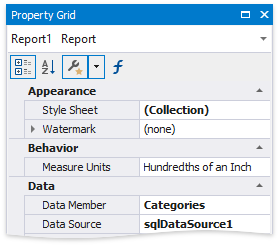
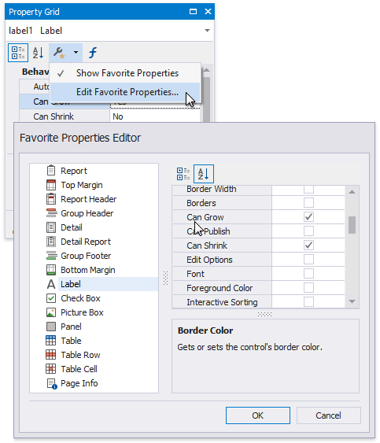
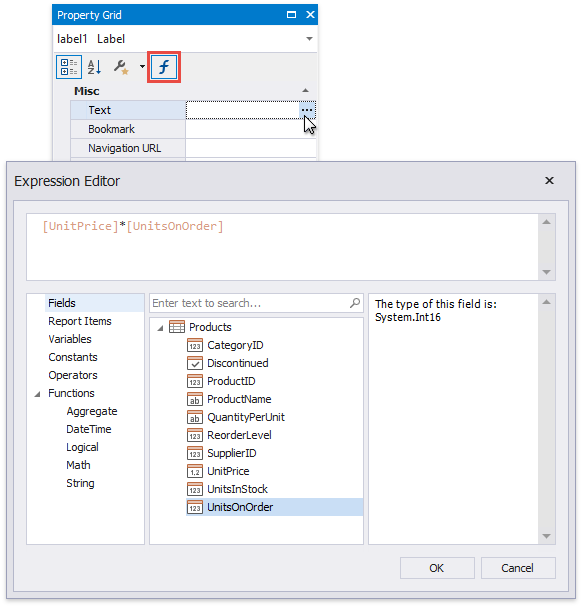
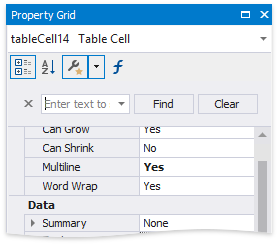

# Property Grid

The **Property Grid** allows you to access and customize the report's and report elements' settings.

## Select a Report Element
Do one of the following to select an element and show its properties in the Property Grid:

* Select a required element in the drop-down list at the top of the Property Grid.
	
	
* Click a required element in the [design surface](../../introduction-to-banded-reports.md).
* Select a required element in the [Report Explorer](report-explorer.md).

## Display Modes
The Property Grid can display element properties in the alphabetical flat order or combine them into categories depending on their purposes. Use the dedicated buttons to switch between these display modes. 

## Change Property Values
To set a property value, locate this property and specify its value using the corresponding editor. 

Specific properties contain nested properties, which you can access by clicking the property caption's expand button.

## Display Favorite Properties

The Property Grid provides the **Favorite** view that allows you to display favorite or most frequently used properties. 

Selecting the **Show Favorite Properties** menu item displays the favorite list and adds a star to the **Properties** button's icon. 

Click the **Edit Favorite Properties** menu item to set up the favorite properties. In the invoked **Favorite Properties Editor**, enable check boxes for the controls' properties to include these properties to the favorite list.

## Specify Expressions

If [expression bindings](../../bind-to-data/data-binding-modes.md) are enabled, the Property Grid contains the **Expressions** tab allowing you to assign values to various element properties. Clicking any property's ellipsis button invokes the **Expression Editor**, in which you can specify [custom expressions](../../use-expressions.md) with available data fields.

## Search for Properties
The Property Grid includes the search box that allows you to search for a required property. Select a property in the Property grid and press CTRL+F. In the displayed editor, enter text to search. The Property Grid automatically creates a search criteria based on the entered text and filters the list of available properties.

