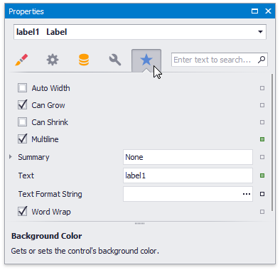
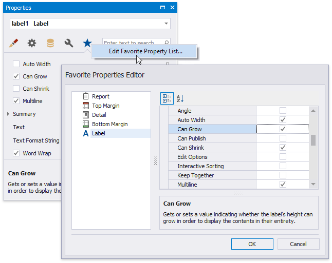
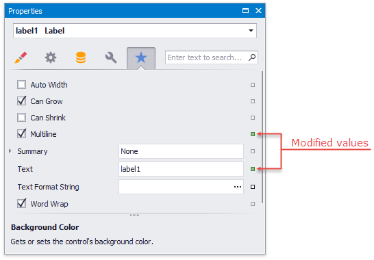
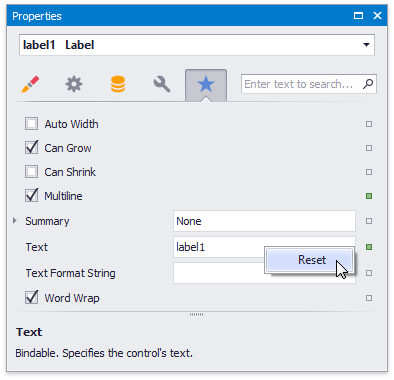
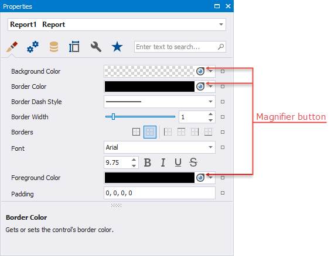
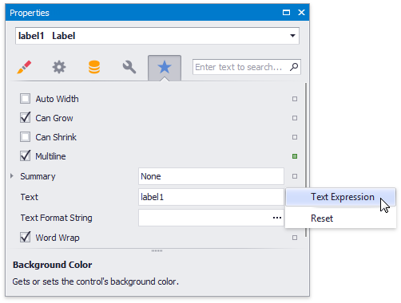
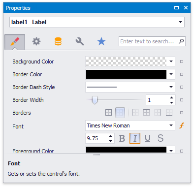
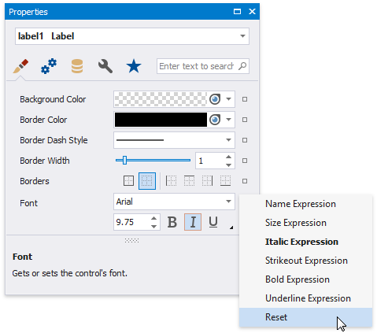
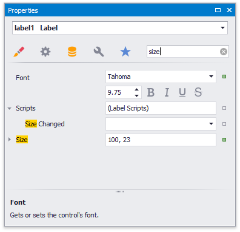

# Property Grid

The **Property Grid** allows you to access and customize report/report element settings.

## Select a Report Element

Perform one of the following actions to select an element and show its properties in the Property Grid:

* Select an element in the drop-down list at the top of the Property Grid.

	

* Click an element in the [design surface](../../first-look-at-the-report-designer.md).
* Select an element in the [Report Explorer](report-explorer.md).

## Property Grid Tabs

The Property Grid displays properties in tabs. The active tab is activated at the application's next start.

## Favorite Properties

The **Favorites** tab displays favorite or most frequently used properties.

Click the **Edit Favorite Properties** context menu item to set up the favorite properties. In the invoked **Favorite Properties Editor**, enable check boxes for the controls' properties to include these properties into the favorite list.

## Change Property Values

The Property Grid adds a green property marker to properties if their default value changes.

Right-click a property's editor to reset the value.

## Set Color Properties

You can use the Magnifier to set color properties.

Do the following to use the Magnifier:

- Click the Magnifier button.
- Move the invoked Magnifier on the screen to find the color you want to set.

	

	You can use the Magnifier to zoom out. Use one of the following options to do this:

	- Hold Ctrl and press + / -
	- Scroll the mouse wheel

- Click to set the color property to the selected color.

	

Right click to cancel the Magnifier mode.

## Specify Expressions

If [expression bindings](../../bind-to-data/data-binding-modes.md) are enabled, the Property Grid allows you to specify expressions that can include two or more data fields and various functions. Click a property's marker to see whether the invoked context menu has the **PropertyName Expression** item.

Click this item to specify an expression in the invoked Expression Editor.

The Property Grid highlights properties that have an assigned expression.

Click a property's marker and choose **Reset** to reset the property value.

> [!Note]
> The **Reset** command resets both the expression and the value you specified using the property editor.

## Search Properties

The Property Grid's search box allows you to search for a property. When you type within the search box, the Property Grid automatically creates a search criteria based on the entered text and filters the list of available properties.

If you type two substrings separated by a space character, these substrings are considered as individual conditions combined by the OR logical operator. To find properties that contain both substrings (to use the AND logical operator), enclose the entered string in quotation marks.

## Non-Tabbed View

The non-tabbed view allows users to switch between categorized and alphabetical modes.

  

  - In the categorized mode, properties are listed in a tree-like form.

    

  - In the alphabetical mode, all properties are displayed in a single list and are sorted alphabetically by name.

    