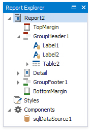
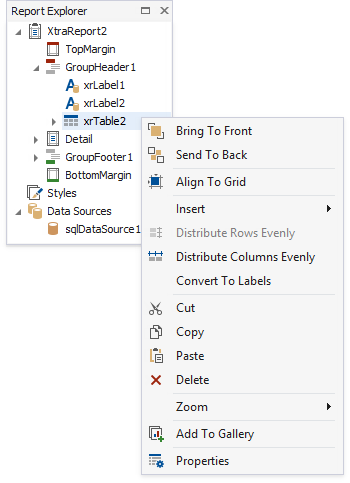
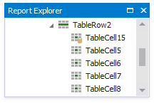
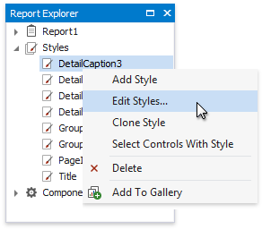

# Report Explorer
The **Report Explorer** shows a report's structure in a tree-like form providing easy access to report elements. Additionally, the **Report Explorer** contains the **Components** node, which displays non-visual report components, such as data objects created when binding a report to a data source.

Once a report element or component has been selected in the Report Explorer, its settings can be changed using the [Toolbar](../toolbar.md) or [Property Grid](property-grid.md). You can also right-click elements and components to invoke their context menu.

Data-aware controls are marked with a special database icon in the Report Explorer.

The **Report Explorer** also provides quick access to all [styles](../../customize-appearance/report-visual-styles.md) available for a report. You can manage styles using commands available in the context menu. To invoke a context menu, right-click the corresponding root node or their sub-node.

To apply a style to a report control, drag it from the Report Explorer onto the required report control.

If the Report Explorer is hidden, you can enable it. To do this, select  in the **Windows** | **Report Explorer** on the [Toolbar](../toolbar.md)'s **View** page.