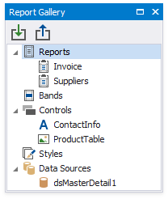

# Report Gallery

The **Report Gallery** allows you to store common report controls, styles, data sources and full report layouts, and re-use them in different reports.

Do not confuse the Report Gallery with the [Report Explorer](report-explorer.md), which has a similar user interface, but provides a different functionality. The Report Gallery enables you to create frequently used templates and apply them afterward to other reports. The Report Explorer reflects the current report structure and displays components and styles available in the report.

## Manage Report Controls
You can combine [report controls](../../use-report-elements.md) residing within the same [band](../../introduction-to-banded-reports.md) into a template. To do this, select one or multiple controls while holding down the SHIFT or CTRL key. Right-click the selection and choose **Add To Gallery** in the context menu.

This adds a new template to the **Controls** section under the name containing control names separated by commas. If you need to change the template name, select **Rename** in the template's context menu and type a new name.

To apply a control template to a report, drag and drop the corresponding item from the Report Gallery onto a required band.

Note that the template stores various settings related to its controls, such as binding information, appearance options, etc. All these settings are restored after adding controls to a report.

## Manage Styles
To create a style template, right-click a required style in the Report Explorer and select **Add To Gallery**. This adds a related item to the **Styles** category.

You can then add a style to a report using one of the following ways:

* To add a style to the report's style sheet, right-click the corresponding item in the Report Gallery and select **Add to Report Style Sheet** in the context menu.
	
	
	
	You can also add all styles available in the Report Gallery using the context menu of the **Styles** node.
* To apply a style to a required report control, drag and drop this style from the Report Gallery onto this control. This also adds the selected style to the report style sheet, if it does not already contain this style.
	
	

## Manage Components
You can add a fully configured data source to a template and use it in other reports without creating the same data source from scratch.

Right-click a required data source in the Report Explorer and select **Add To Gallery**. This creates a new template in the **Components** category of the Report Gallery.

To add a data source template to a report, do one of the following:

* Right-click the data source in the Report Gallery and select **Add to Report Components** in the context menu.
	
	
* Drag and drop the data source from the Report Gallery onto the report.

## Manage Report Layouts
The Report Gallery allows you store report layout templates in the **Reports** category.

To create a new report layout, right-click a report and select **Add To Gallery** in the context menu.

To apply a template to the current report, do one of the following:

* Right-click the template in the Report Gallery and select **Apply Layout to Report**.
	
	
* Drag-and-drop the template from the Report Gallery onto a report.

The following dialog appears to warn you about overriding the current layout:

When loading the report layout, all associated styles, formatting rules, and components are added to the report as well.

## Load and Save the Report Gallery
You can load templates from a separate file containing gallery items in a special format. For this, right-click an empty space in the Report Gallery and select **Load Gallery**. In the invoked **Open** dialog, locate the required file and click **OK**.

To save the Report Gallery templates to an XML file, select **Save Gallery As** in the Gallery's context menu and specify a target file in the **Save** dialog.
