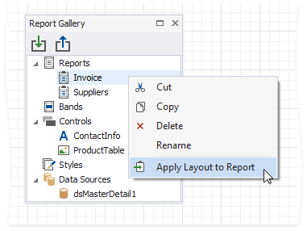
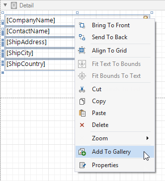
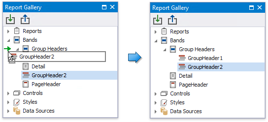

# Report Gallery

The **Report Gallery** allows you to store and reuse reports and their elements.

Do not confuse the Report Gallery with the [Report Explorer](report-explorer.md) that has a similar user interface. The Report Gallery stores shared templates. The Report Explorer displays the current report structure.

> [!NOTE]
> **Watch the Video**: [Report Gallery (YouTube)](https://www.youtube.com/watch?v=SEaEMVFoIAw)

## Reports

The Report Gallery displays report layout templates in the **Reports** category.

To create a new template, right-click an empty area around the design surface and select **Add To Gallery** in the context menu. The report's **Name** property value defines the template name.

Do one of the following to apply a template to the current report:

* Right-click the template in the Report Gallery and select **Apply Layout to Report**.

	

* Drag and drop the template from the Report Gallery onto the report.

	

The following dialog warns you that the template overrides the current layout:

When you apply the report template, all the associated styles and components are added to the current report as well.

## Bands

The Report Gallery's **Bands** category contains [band](../../../../../articles/report-designer/report-designer-for-winforms/introduction-to-banded-reports.md) templates.

To create a new template, right-click a report band and choose **Add To Gallery** in the context menu. The band's **Name** property value defines the template name.

Use the following ways to apply a band template:

* **Drag and Drop**

	Drag and drop the template from the Report Gallery onto the band of the same type to replace the band's content.

	

	To create a new band, move the mouse cursor to the delimiter between bands and drop the template.

	

	You can always create new Detail Report bands and Group Headers/Footers. You can add the Report Header/Footer or Page Header/Footer only if the report does not contain this band.

* **Gallery Context Menu**

	Right-click a template in the Report Gallery and choose **Apply Layout to Band** in the context menu.

	

	This action's behavior depends on the template's band type and the selected report band.

	| Template's Band Type | Action Result |
	|--- | --- |
	| **Detail Band**, **Vertical Detail Band**, **Top Margin**, **Bottom Margin** | Replaces the corresponding band's content independently from the selected band type. |
	| **Group Header**, **Group Footer**, **Detail Report Band** | If the same band is selected in the report, replaces the band's content. Otherwise, adds a new band to the deepest hierarchy level. |
	| **Report Header**, **Report Footer**, **Page Header**, **Page Footer**, **Vertical Header**, **Vertical Footer** | If the same band exists in the report, replaces the band's content. Otherwise, adds a new band. |

Note that the template stores settings related to the band and its controls ([binding information](../../../../../articles/report-designer/report-designer-for-winforms/bind-to-data/bind-controls-to-data-expression-bindings.md), [appearance options](../../../../../articles/report-designer/report-designer-for-winforms/customize-appearance/appearance-properties.md), etc). All these settings are restored when you apply the template.

## Controls

You can combine [report controls](../../../../../articles/report-designer/report-designer-for-winforms/use-report-elements.md) from the same band into a template. Hold down SHIFT or CTRL and select controls. Then, right-click the selection and choose **Add To Gallery** in the context menu.

This adds a new template to the **Controls** section. The template name consists of control names separated by commas.

To apply a control template, drag and drop it from the Report Gallery onto a band.

All the control settings are restored when you apply the template.

## Styles

Right-click a style in the Report Explorer and select **Add To Gallery** to create a new template in the **Styles** category.

Use the following ways to apply a style template:

* To add the style to the report's [style sheet](../../../../../articles/report-designer/report-designer-for-winforms/customize-appearance/report-visual-styles.md#sheets), right-click the style in the Report Gallery and select **Add to Report Style Sheet**.
	
	
	
	You can also use the same action in the **Styles** node's context menu to add all the styles available in the Report Gallery.

* To apply the style to a specific report control, drag and drop this style from the Report Gallery onto this control. This also adds the selected style to the report style sheet if it does not already contain this style.
	
	

## Components

Right-click a data source in the Report Explorer and select **Add To Gallery** to create a new template in the **Components** category.

Do one of the following to apply a data source template:

* Right-click the template in the Report Gallery and select **Add to Report Components** in the context menu.

	

* Drag and drop the template from the Report Gallery onto the report.

## Rename Templates

To change the template name, select **Rename** in the template's context menu and type a new name.

## Group Templates

Right-click a root Gallery node and select **Add New Folder** in the context menu.

Specify the folder name. Move templates to this folder to combine them into a group.

## Import and Export Templates

You can import gallery items from an XML file. Right-click the **Import** toolbar button, locate a file in the invoked **Open** dialog and click **OK**.

To save gallery templates to an XML file, click the **Export** toolbar button and select a target file in the **Save** dialog.

## Template Storage

The Report Gallery stores templates in the **%localappdata%\Developer Express Inc\XtraReports Suite\ReportGallery.xml** file.
