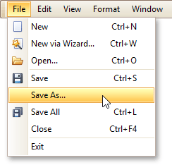
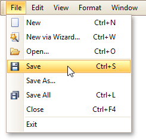

# Back Up the Current Layout Before Modifying It
To guarantee that you will be able to revert your report to its original state, you need to create a _backup copy_. Then, you can apply changes without worrying that it will be hard to restore your report, in case something breaks.
* To save a copy of your report, in the [Main Menu](../report-designer-reference/report-designer-ui/main-menu.md), select **File** | **Save As**.
	
	
	
	Then, in the invoked standard **Save** dialog, specify the folder and file name.
* To save the current layout of your report, in the Main Menu select **File** | **Save**, or press CTRL+S. In this case, the report will be saved in the application's current folder.
	
	
* To load a previously saved report, in the Main Menu, click **File** | **Open**, or press CTRL+O. The standard **Open** dialog will allow you to locate and open report files.