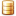
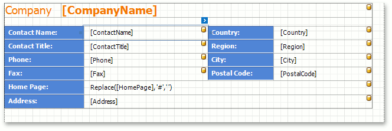
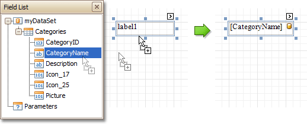
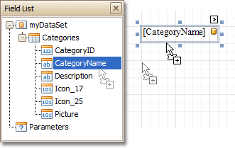
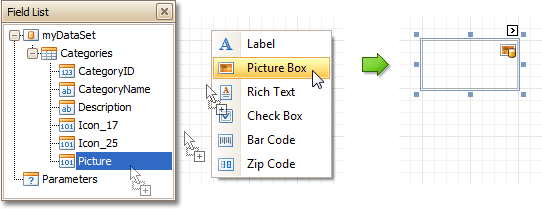
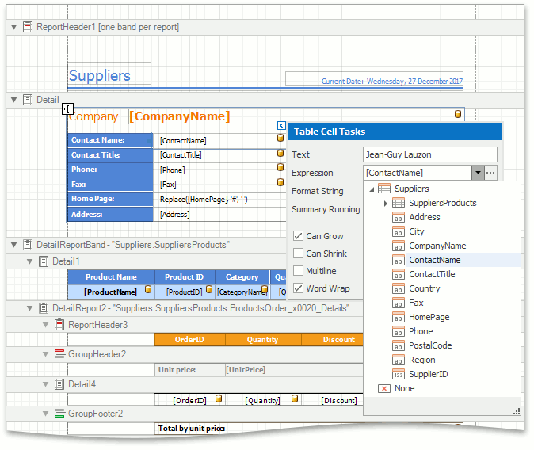
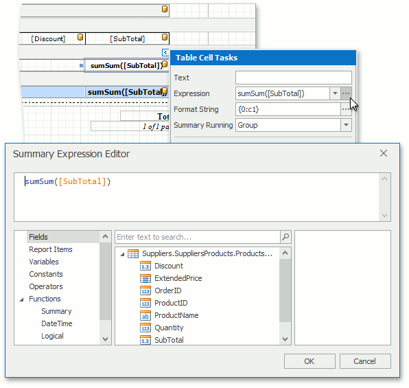
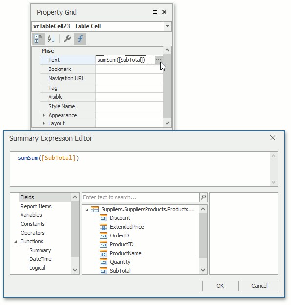

# Binding Report Elements Using Expression Bindings
> [!WARNING]
> This topic describes an approach you can use when *expression bindings* are enabled in the Report Designer. If the **Expressions** () icon is missing in the [Property Grid] (../report-designer-reference/report-designer-ui/property-grid.md), then *expression bindings* are not enabled, and you should refer to the [Binding Report Elements to Data](displaying-values-from-a-database-(binding-report-elements-to-data).md) topic instead.

Report [controls](../report-designer-reference/report-controls.md) can display both [static](add-or-modify-static-information-in-your-report.md) information and data fetched from a  [bound database](../create-reports/binding-a-report-to-data.md).

In the [Design Panel](../report-designer-reference/report-designer-ui/design-panel.md), each data-bound control has a yellow database icon () in 
the top-right corner.

You can use the following approaches to include information from a data source to your report:

* [Using the Field List](#using-the-field-list)
* [Using the Smart Tag](#using-the-smart-tag)
* [Using the Expressions Tab in the Property Grid](#using-the-expressions-tab-in-the-property-grid)

## Using the Field List
* To bind an existing report control to a data field, drag the required field item from the [Field List](../report-designer-reference/report-designer-ui/field-list.md) onto the control. The yellow database icon indicates that it has been successfully bound.
	
	
* To add a new data-bound control, simply drag the required data field from the Field List onto a report band. This will create a [Label](../report-designer-reference/report-controls/label.md) bound to this data field.

	
* A more flexible way to create data-bound elements is to right-click a Field List item, and then drag and drop it onto a report. This invokes the [Context Menu](../report-designer-reference/report-designer-ui/context-menu.md), where you can choose a control to visualize  data. The selected control will be automatically created and bound to a selected data field.
	
	

## Using the Smart Tag
Click a control's [Smart Tag](../report-designer-reference/report-designer-ui/smart-tag.md). In the actions list, expand the **Expression** drop-down list and select the required field.

 
Alternatively, you can click the ellipsis button to the right of the **Expression** field and create a complex binding [expression](../../../expression-editor/expression-operators-functions-and-constants.md) in the invoked [Expression Editor](../../../expression-editor.md).

## Using the Expressions Tab in the Property Grid
Focus the required report control and select the **Expressions** () tab in the [Property Grid](../report-designer-reference/report-designer-ui/property-grid.md). Click the ellipsis button to the right of the **Text** property to invoke the Expression Editor and specify an expression.

