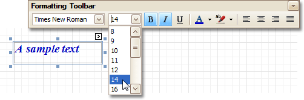
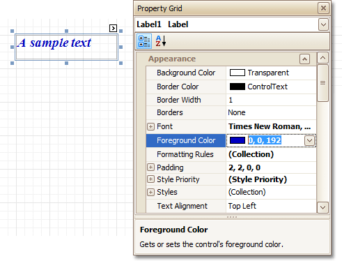

# Change Fonts and Colors of Report Elements
To change fonts and colors (as well as paddings, text alignment and other appearance properties) of a report [control](../report-designer-reference/report-controls.md) or [band](../report-designer-reference/report-bands.md), select this element and do one of the following.
* Use the [Formatting Toolbar](../report-designer-reference/report-designer-ui/formatting-toolbar.md).
	
	
* Use the [Property Grid](../report-designer-reference/report-designer-ui/property-grid.md), where all appearance-related properties are located under the **Appearance** category.
	
	

Note that the appearance settings of a band are applied to all controls contained within it.

When it's required to apply styles in bulk, we recommend using common _style templates_, which also can be stored in an external style sheet file, and applied to multiple reports. In addition, this allows you specify separate _odd/even styles_, to improve your reports' readability. Another noteworthy option, is the capability to _conditionally_ change the appearance of report elements based on a certain logical expression (e.g. if a control's value satisfies some rule). For more information, refer to [Styles and Conditional Formatting in Reports](../create-reports/styles-and-conditional-formatting-in-reports.md).