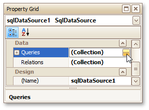

If a report is [bound to a data source](../../../../../interface-elements-for-desktop/articles/report-designer/report-designer-for-winforms/create-reports/binding-a-report-to-data.md) that contains far more rows than are necessary for processing report creation, you can exclude excessive or undesired data. To accomplish this, construct a filtering expression using single or multiple data fields.

This document describes two approaches to filtering data in the Report Designer.
* [Filter Data at the Report Level](#reportlevel)
* [Filter Data at the Data Source Level](#datasourcelevel)

## <a name="reportlevel"/>Filter Data at the Report Level
To filter a report's data, click its [Smart Tag](../../../../../interface-elements-for-desktop/articles/report-designer/report-designer-for-winforms/report-designer-reference/report-designer-ui/smart-tag.md), and in the invoked actions list, click the ellipsis button for the **Filter String** property. Then, in the invoked **Filter String Editor**, construct an expression.

When creating a filter criteria, you can create and edit logical expressions and also join the expression groups with And, Or, Not And, and Not Or operators. In every filter condition, the left part contains either the data field name or the name of the [calculated field](../../../../../interface-elements-for-desktop/articles/report-designer/report-designer-for-winforms/report-editing-basics/add-calculated-fields-to-a-report.md), which exists in this data source at the same level. The right part of the condition contains either a certain numerical or string value, or the name of the [report parameter](../../../../../interface-elements-for-desktop/articles/report-designer/report-designer-for-winforms/report-editing-basics/add-parameters-to-a-report.md).

To access parameters, click the icon on the right, until it turns into a question mark.

To quit the dialog and save the changes, click **OK**.

## <a name="datasourcelevel"/>Filter Data at the Data Source Level
To filter data before it has been supplied to a report, you can modify a query of a SqlDataSource assigned to the report's **Data Source** property. To do this, perform the following steps.
1. Invoke the **Manage Queries** dialog using one of the following ways.
	* Switch to the [Report Explorer](../../../../../interface-elements-for-desktop/articles/report-designer/report-designer-for-winforms/report-designer-reference/report-designer-ui/report-explorer.md) or [Field List](../../../../../interface-elements-for-desktop/articles/report-designer/report-designer-for-winforms/report-designer-reference/report-designer-ui/field-list.md) and right-click the data source item. In the invoked context menu, select the **Manage Queries** command.
		
		
	* Select a data source, and in the [Property Grid](../../../../../interface-elements-for-desktop/articles/report-designer/report-designer-for-winforms/report-designer-reference/report-designer-ui/property-grid.md), click the ellipsis button for the **Queries** property.
		
		
2. In the invoked dialog, click the ellipsis button corresponding to the required query.
	
	
3. Next, in the invoked **Query Editor**, click the **Run Query Builder** button.
	
	
4. In the [Query Builder](../../../../../interface-elements-for-desktop/articles/report-designer/report-designer-for-winforms/report-designer-reference/report-designer-ui/query-builder.md), click the **Filter** button. In the invoked **Filter Editor**, construct a filtering expression that will be used to filter resulting data at the data source level.
	
	
	
	Note that it is possible to embed [query parameters](../../../../../interface-elements-for-desktop/articles/report-designer/report-designer-for-winforms/report-editing-basics/use-query-parameters.md) into the expression.