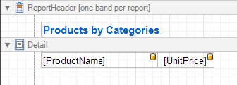
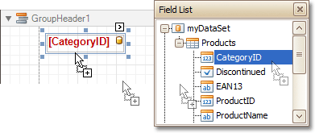
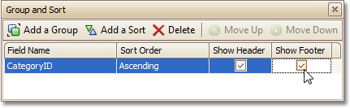
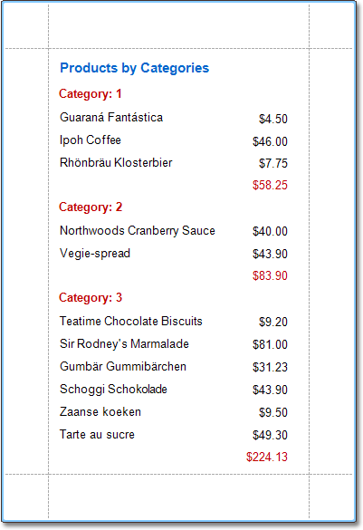

# Change or Apply Data Grouping to a Report
This document demonstrates how to group a report's data. Note that data grouping can be performed only if a report is [bound to a data source](../create-reports/binding-a-report-to-data.md).

To group records in a report, do the following.
1. [Create a new report](../create-reports/basic-operations/create-a-new-report.md) and [bind it to a data source](../create-reports/binding-a-report-to-data.md). In this tutorial, we'll start with the following report.
	
	
2. Now, switch to the [Group and Sort Panel](../report-designer-reference/report-designer-ui/group-and-sort-panel.md), and click **Add a Group**. In the invoked list, choose a data member across which the report is to be grouped. Note that grouping across [calculated fields](add-calculated-fields-to-a-report.md) is supported, as well.
	
	
	
	If multiple groups are created, you can specify the priority for each group, by selecting it in the Group and Sort Panel, and using the **Move Up** and **Move Down** buttons.
3. After this, a [Group Header](../report-designer-reference/report-bands/grouping-bands.md) band is added to the report, with the specified data member being set as its grouping criterion.
	
	Now, it's only left to drop the corresponding item from the [Field List](../report-designer-reference/report-designer-ui/field-list.md) onto this band, so that it's displayed as a header for each group.
	
	
	
	If required, you also can apply [mail merge](use-mail-merge-in-report-elements.md) to this label.
4. In addition, you can enable the corresponding Group Footer band, by checking the **Show Footer** option in the Group and Sort Panel.
	
	
	
	To manage the sorting order of the group's items (ascending or descending), use the **Sort Order** drop-down list. You can disable sorting in grouped data by selecting **None**.
5. Then, you can [calculate a total](add-totals-to-a-report.md) across the group, by placing a [Label](../report-designer-reference/report-controls/label.md) onto this band, and specifying its **Summary** properties in the following way.
	
	
	
	Note also that _value formatting_ is applied to a summary independently of the [general formatting](change-value-formatting-of-report-elements.md), and has a greater priority.

The report is now ready. Switch to the [Preview Tab](../report-designer-reference/report-designer-ui/preview-tab.md), and view the result.

To learn how groups can be sorted against a summary function result, see [Sort Groups by a Summary Function Result](../create-reports/miscellaneous/sort-groups-by-a-summary-function-result.md).

To learn how page numbers can be added to groups independently from the report's page numbers, refer to [Add Page Numbers for Groups](../create-reports/miscellaneous/add-page-numbers-for-groups.md).