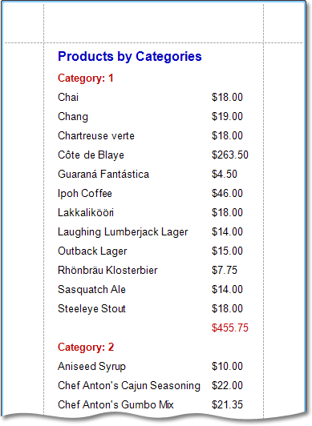

# Change or Apply Data Sorting to a Report
This document demonstrates how to sort a report's data. Note that as with data grouping, sorting can be performed only if a report is [bound to a data source](../create-reports/binding-a-report-to-data.md). In this example, we'll use the report created in the following tutorial: [Change or Apply Data Grouping to a Report](change-or-apply-data-grouping-to-a-report.md).

To sort records in a data-aware report, do the following.
1. Switch to the [Group and Sort Panel](../report-designer-reference/report-designer-ui/group-and-sort-panel.md), and click **Add a Sort**. In the invoked list, choose a data member across which the report is to be sorted.
	
	
	
	Note that sorting across [calculated fields](add-calculated-fields-to-a-report.md) is supported, as well.
2. To manage the sorting order (ascending or descending), use the **Sort Order** drop-down list.
	
	And, if multiple sorting criteria are specified, you can define the priority for each one, by selecting it in the Group and Sort Panel, and using the **Move Up** and **Move Down** buttons.

The sorting is now applied. Switch to the [Preview Tab](../report-designer-reference/report-designer-ui/preview-tab.md), and view the result.

