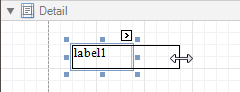

# Change the Layout of Report Elements
To select a [control](../report-designer-reference/report-controls.md), click it. To select the next control in tab order, press TAB. To select the previous control in tab order, click SHIFT + TAB.

Individual controls can be moved, using either mouse or keyboard.

They can be precisely aligned to each other using the _Snap Gird_ and/or _Snap Lines_. For details on this, refer to [Controls Positioning](../create-reports/basic-operations/controls-positioning.md).

To resize a control using the mouse, select it, and then drag a rectangle drawn on its edge or corner.

To resize a [band](../report-designer-reference/report-bands.md), drag its header strip.

To resize an element using the keyboard, press SHIFT+ARROW or CTRL+SHIFT+ARROW.

To select multiple elements, do one of the following.
* Click elements while holding CTRL or SHIFT.
* Click on a blank space and drag the mouse to create a selection frame. When the mouse button is released, all controls within the selection frame's boundaries will be selected. In this case, the previous selection is cleared.
	
	

You can also easily align multiple controls or make them the same size, by utilizing the [Layout Toolbar](../report-designer-reference/report-designer-ui/layout-toolbar.md).

In addition, to copy, paste and delete controls simultaneously, you can place them within the [Panel](../report-designer-reference/report-controls/panel.md).

For more information, refer to [Controls Positioning](../create-reports/basic-operations/controls-positioning.md).