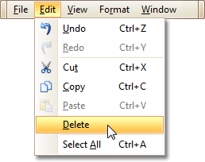

# Delete Report Elements
To delete a report element ([band](../report-designer-reference/report-bands.md) or [control](../report-designer-reference/report-controls.md)), select it in the [Design Panel](../report-designer-reference/report-designer-ui/design-panel.md) or [Report Explorer](../report-designer-reference/report-designer-ui/report-explorer.md) (to select multiple elements, hold down SHIFT while selecting), and then do one of the following.
* Press DELETE.
* Right-click the report element, and in the invoked [Context Menu](../report-designer-reference/report-designer-ui/context-menu.md), choose **Delete**.
	
	
* In the [Main Menu](../report-designer-reference/report-designer-ui/main-menu.md), select **Edit | Delete**.
	
	

> [!NOTE]
> You can cancel the operation by pressing CTRL+Z.

Note that certain elements cannot be deleted (such as the [Detail band](../report-designer-reference/report-bands/detail-band.md)).