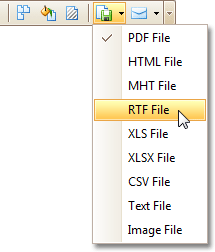

# Manually Update Report Output
Sometimes you may need to simply update a couple of values in your report before printing it. In these cases, the simplest way to correct your report is to export it to an editable file (e.g. RTF), then use an appropriate editor tool to edit values and print your report.

To export a report, switch to the [Preview Tab](../report-designer-reference/report-designer-ui/preview-tab.md) and click the arrow near the **Export Document...** button .

To learn more about report exporting, see [Exporting from Print Preview](../../../print-preview/print-preview-for-winforms/exporting/exporting-from-print-preview.md).