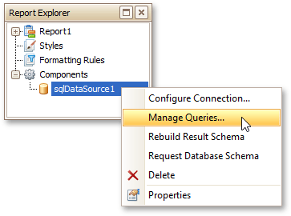
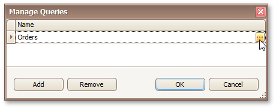
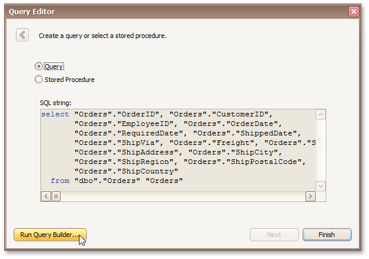
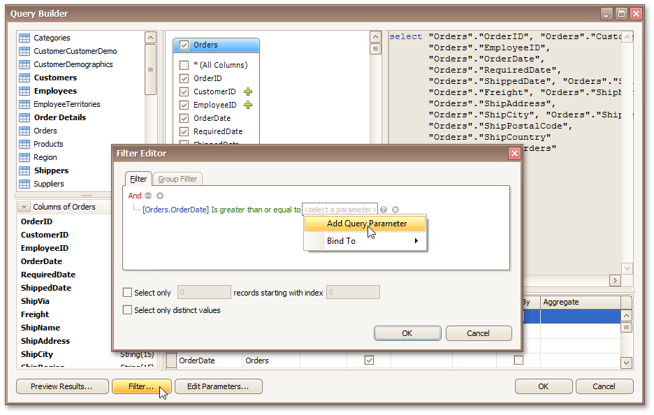
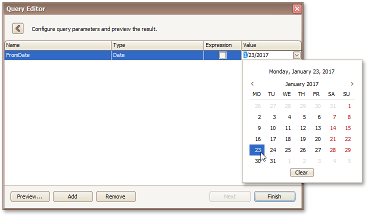
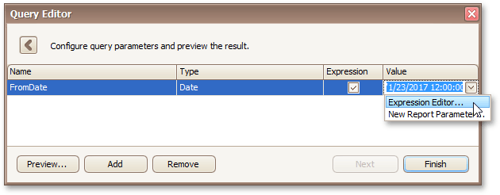
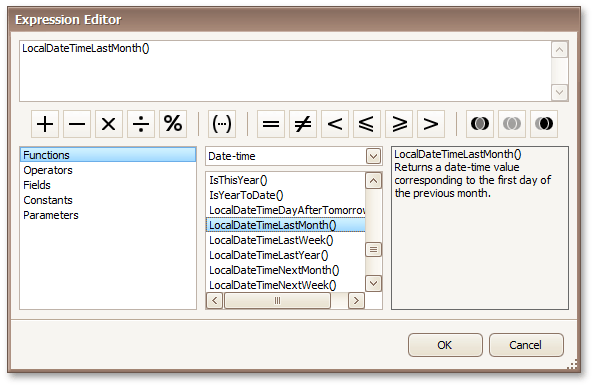
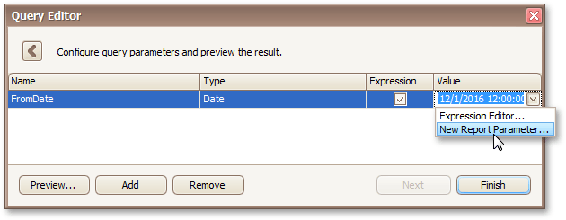
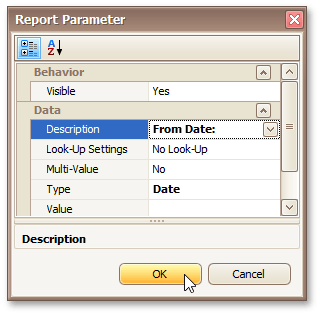
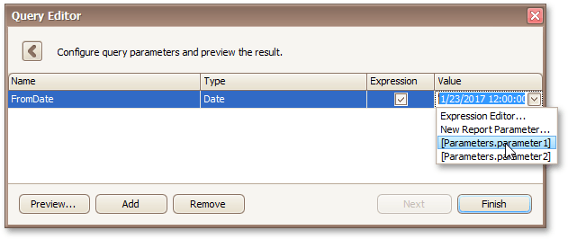

# Use Query Parameters
This document describes the common ways of utilizing query parameters to perform simple and straightforward data source level data shaping.

This topic consists of the following sections.
* [Query Parameters Overview](#overview)
* [Create and Configure Query Parameters](#configurequeryparameters)
* [Provide the Query Parameter Value](#providevalues)

## <a name="overview"/>Query Parameters Overview
A query parameter holds an external value that is inserted into a SQL statement before query execution. This value can be either static or dynamically generated by an associated expression.

The query parameter's value is inserted into the resulting SQL query string in the position of the corresponding placeholder, which has the "**@QueryParameterName**" form.

In the Report Designer, query parameters are typically used in the following scenarios.
* Passed as criteria to the **WHERE** part of a SQL statement to perform [data source level filtering](change-or-apply-data-filtering-to-a-report.md).
* Passed as actual parameters to a stored procedure.

## <a name="configurequeryparameters"/>Create and Configure Query Parameters
To create and configure query parameters to filter report data, do the following.
1. When creating a new data-bound report using the [Report Wizard](../report-wizard.md) or [binding an existing one to a SQL data source](../create-reports/binding-a-report-to-data/bind-a-report-to-a-database.md), go to the [query customization](../report-wizard/data-bound-report/connect-to-a-database/create-a-query-or-select-a-stored-procedure.md) page. On this page, click the  button for the **Queries** category to create a new query using the [Query Builder](../report-designer-reference/report-designer-ui/query-builder.md).
	
	
	
	To open the query customization page to customize an existing data source, right-click this data source in the [Report Explorer](../report-designer-reference/report-designer-ui/report-explorer.md) or [Field List](../report-designer-reference/report-designer-ui/field-list.md) and select **Manage Queries** in the context menu.
	
	
	
	Then, in the invoked **Manage Queries** dialog, click the ellipsis button for the required query.
	
	
	
	In the invoked **Query Editor**, click the **Run Query Builder** button.
	
	
2. In the [Query Builder](../report-designer-reference/report-designer-ui/query-builder.md), construct the query, and then, click the **Filter** button. In the invoked **Filter Editor**, construct a filtering expression that will be used to filter resulting data at the data source level. To access parameters, click the icon on the right until it turns into a question mark. Then, click the parameter placeholder and select **Add Query Parameter**.
	
	
3. In the invoked **Create Query Parameter** dialog, specify the parameter's name and appropriate value type, and click **OK**.
	
	
	
	Close the **Filter Editor**, and then, complete the **Query Builder**.

As a result, the query parameter is passed to the **WHERE** part of the SQL string and has the "**@QueryParameterName**" form.

Then, click **Next** to proceed to the next wizard page and specify query parameter values as described in the document section below.

## <a name="providevalues"/>Provide Query Parameter Values
The [configure query parameters](../report-wizard/data-bound-report/connect-to-a-database/configure-query-parameters.md) wizard page provides access to query parameters and allows you to add, configure and remove them. On this page, specify the actual value (either static or dynamic) for a query parameter.
* **Specifying a static value**
	
	To specify a static value for a query parameter, select the parameter's value type, and then specify its actual value in the **Value** column according to the selected type.
	
	
* **Specifying a dynamic value**
	
	To use a dynamically generated value, do the following.
	
	First, activate the **Expression** check box for the required parameter. This allows you to use an expression to dynamically calculate the parameter's actual value.
	
	Now, you have the following three options for specifying an expression to calculate the parameter value.
	* To create a complex expression, expand the drop-down list for the **Value** property and select **Expression Editor**.
		
		
		
		Construct the required expression in the invoked **Expression Editor**.
		
		
	* To map the query parameter to a new [report parameter](add-parameters-to-a-report.md), expand the drop-down list for the **Value** property and select **New Report Parameter**.
		
		
		
		In the invoked **Report Parameter** dialog, specify the required report parameter settings. Be sure to specify the report parameter type according to the type of the respective query parameter. Click **OK** to exit the dialog.
		
		
	* You can map a query parameter to a report parameter that already exists in a report by referring to its value from a simple expression. To do this, expand the drop-down list for the **Value** property and select the parameter that you want to use. The appropriate expression string will be generated automatically.
		
		