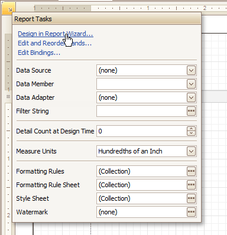

# Report Wizard
The **Report Wizard** is a tool that allows you to easily create reports based on built-in templates. Using this tool, you can do the following.
* **Create a new report from scratch**
	
	In the main toolbar, click **New Report** | **New Report via Wizard...** or press CTRL+W.
* **Edit an existing report**
	
	Click the report's [Smart Tag](report-designer-reference/report-designer-ui/smart-tag.md) and in the invoked actions list, click the **Design in Report Wizard...** context link.
	
	
	
	> [!NOTE]
	> In this case, data binding steps are omitted, since a report already has a bound data source. Note that the initial report layout will be lost after completing the wizard.

The following is a complete list of pages that may be available in the Report Wizard.
* [Choose a Report Type](report-wizard/choose-a-report-type.md)
	* [Empty Report](report-wizard/empty-report.md)
	* [Data-bound Report](report-wizard/data-bound-report.md)
		* [Select the Data Source Type](report-wizard/data-bound-report/select-the-data-source-type.md)
		* [Connect to a Database](report-wizard/data-bound-report/connect-to-a-database.md)
			* [Select a Data Connection](report-wizard/data-bound-report/connect-to-a-database/select-a-data-connection.md)
			* [Specify a Connection String](report-wizard/data-bound-report/connect-to-a-database/specify-a-connection-string.md)
			* [Save the Connection String](report-wizard/data-bound-report/connect-to-a-database/save-the-connection-string.md)
			* [Create a Query or Select a Stored Procedure](report-wizard/data-bound-report/connect-to-a-database/create-a-query-or-select-a-stored-procedure.md)
			* [Configure Query Parameters](report-wizard/data-bound-report/connect-to-a-database/configure-query-parameters.md)
		* [Connect to an Entity Framework Data Source](report-wizard/data-bound-report/connect-to-an-entity-framework-data-source.md)
			* [Select the Data Context](report-wizard/data-bound-report/connect-to-an-entity-framework-data-source/select-the-data-context.md)
			* [Select the Connection String](report-wizard/data-bound-report/connect-to-an-entity-framework-data-source/select-the-connection-string.md)
			* [Specify a Connection String](report-wizard/data-bound-report/connect-to-an-entity-framework-data-source/specify-a-connection-string.md)
			* [Bind to a Stored Procedure](report-wizard/data-bound-report/connect-to-an-entity-framework-data-source/bind-to-a-stored-procedure.md)
		* [Connect to an Object Data Source](report-wizard/data-bound-report/connect-to-an-object-data-source.md)
			* [Select an Assembly](report-wizard/data-bound-report/connect-to-an-object-data-source/select-an-assembly.md)
			* [Select a Data Source Type](report-wizard/data-bound-report/connect-to-an-object-data-source/select-a-data-source-type.md)
			* [Select a Data Source Member](report-wizard/data-bound-report/connect-to-an-object-data-source/select-a-data-source-member.md)
			* [Specify the Member Parameters](report-wizard/data-bound-report/connect-to-an-object-data-source/specify-the-member-parameters.md)
			* [Select the Data Binding Mode](report-wizard/data-bound-report/connect-to-an-object-data-source/select-the-data-binding-mode.md)
			* [Select a Data Source Constructor](report-wizard/data-bound-report/connect-to-an-object-data-source/select-a-data-source-constructor.md)
			* [Specify the Constructor Parameters](report-wizard/data-bound-report/connect-to-an-object-data-source/specify-the-constructor-parameters.md)
		* [Connect to an Excel Data Source](report-wizard/data-bound-report/connect-to-an-excel-data-source.md)
			* [Select an Excel Workbook or CSV file](report-wizard/data-bound-report/connect-to-an-excel-data-source/select-an-excel-workbook-or-csv-file.md)
			* [Specify Import Settings](report-wizard/data-bound-report/connect-to-an-excel-data-source/specify-import-settings.md)
			* [Select a Worksheet, Table or Named Region](report-wizard/data-bound-report/connect-to-an-excel-data-source/select-a-worksheet-table-or-named-region.md)
			* [Choose Columns](report-wizard/data-bound-report/connect-to-an-excel-data-source/choose-columns.md)
		* [Choose Columns to Display in Your Report](report-wizard/data-bound-report/choose-columns-to-display-in-your-report.md)
		* [Add Grouping Levels](report-wizard/data-bound-report/add-grouping-levels.md)
		* [Specify Summary Options](report-wizard/data-bound-report/specify-summary-options.md)
		* [Choose a Report Layout](report-wizard/data-bound-report/choose-a-report-layout.md)
		* [Choose a Report Style](report-wizard/data-bound-report/choose-a-report-style.md)
		* [Enter the Report Title](report-wizard/data-bound-report/enter-the-report-title.md)
	* [Label Report](report-wizard/label-report.md)
		* [Select a Label Type](report-wizard/label-report/select-a-label-type.md)
		* [Customize Label Options](report-wizard/label-report/customize-label-options.md)