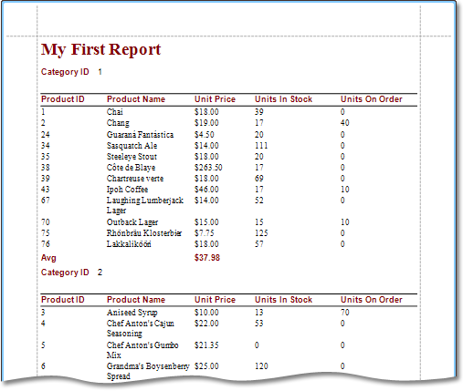

# Data-bound Report
Select the **Data-bound Report** option on the [Choose a Report Type](choose-a-report-type.md) wizard page to create a data-bound report.

After completing the Data-bound Report wizard, you will get a tabular banded report. Depending on how many wizard steps you complete (you do not necessarily have to go through all the pages), you can apply data grouping, display totals, select one of the predefined style sheets, etc.

The following image shows a sample report created using the Data-bound Report Wizard.

Use the links below to learn more about every step of the Data-bound Report wizard.

> [!NOTE]
> Depending on the method you used to [invoke the Wizard](../report-wizard.md), you may be creating an entirely new report or modifying an existing one. Creating reports from scratch requires data source connection knowledge. In these cases, it's better if you contact your application administrator or vendor for assistance with the first three steps of the wizard. If you're modifying an existing report, these initial data binding steps will not appear and you will start with [Choose Columns to Display in Your Report](data-bound-report/choose-columns-to-display-in-your-report.md).

* [Select the Data Source Type](data-bound-report/select-the-data-source-type.md)
* [Connect to a Database](data-bound-report/connect-to-a-database.md)
	* [Select a Data Connection](data-bound-report/connect-to-a-database/select-a-data-connection.md)
	* [Specify a Connection String](data-bound-report/connect-to-a-database/specify-a-connection-string.md)
	* [Save the Connection String](data-bound-report/connect-to-a-database/save-the-connection-string.md)
	* [Create a Query or Select a Stored Procedure](data-bound-report/connect-to-a-database/create-a-query-or-select-a-stored-procedure.md)
	* [Configure Query Parameters](data-bound-report/connect-to-a-database/configure-query-parameters.md)
* [Connect to an Entity Framework Data Source](data-bound-report/connect-to-an-entity-framework-data-source.md)
	* [Select the Data Context](data-bound-report/connect-to-an-entity-framework-data-source/select-the-data-context.md)
	* [Select the Connection String](data-bound-report/connect-to-an-entity-framework-data-source/select-the-connection-string.md)
	* [Specify a Connection String](data-bound-report/connect-to-an-entity-framework-data-source/specify-a-connection-string.md)
	* [Bind to a Stored Procedure](data-bound-report/connect-to-an-entity-framework-data-source/bind-to-a-stored-procedure.md)
* [Connect to an Object Data Source](data-bound-report/connect-to-an-object-data-source.md)
	* [Select an Assembly](data-bound-report/connect-to-an-object-data-source/select-an-assembly.md)
	* [Select a Data Source Type](data-bound-report/connect-to-an-object-data-source/select-a-data-source-type.md)
	* [Select a Data Source Member](data-bound-report/connect-to-an-object-data-source/select-a-data-source-member.md)
	* [Specify the Member Parameters](data-bound-report/connect-to-an-object-data-source/specify-the-member-parameters.md)
	* [Select the Data Binding Mode](data-bound-report/connect-to-an-object-data-source/select-the-data-binding-mode.md)
	* [Select a Data Source Constructor](data-bound-report/connect-to-an-object-data-source/select-a-data-source-constructor.md)
	* [Specify the Constructor Parameters](data-bound-report/connect-to-an-object-data-source/specify-the-constructor-parameters.md)
* [Connect to an Excel Data Source](data-bound-report/connect-to-an-excel-data-source.md)
	* [Select an Excel Workbook or CSV file](data-bound-report/connect-to-an-excel-data-source/select-an-excel-workbook-or-csv-file.md)
	* [Specify Import Settings](data-bound-report/connect-to-an-excel-data-source/specify-import-settings.md)
	* [Select a Worksheet, Table or Named Region](data-bound-report/connect-to-an-excel-data-source/select-a-worksheet-table-or-named-region.md)
	* [Choose Columns](data-bound-report/connect-to-an-excel-data-source/choose-columns.md)
* [Choose Columns to Display in Your Report](data-bound-report/choose-columns-to-display-in-your-report.md)
* [Add Grouping Levels](data-bound-report/add-grouping-levels.md)
* [Specify Summary Options](data-bound-report/specify-summary-options.md)
* [Choose a Report Layout](data-bound-report/choose-a-report-layout.md)
* [Choose a Report Style](data-bound-report/choose-a-report-style.md)
* [Enter the Report Title](data-bound-report/enter-the-report-title.md)