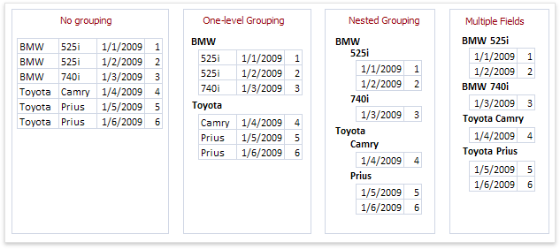
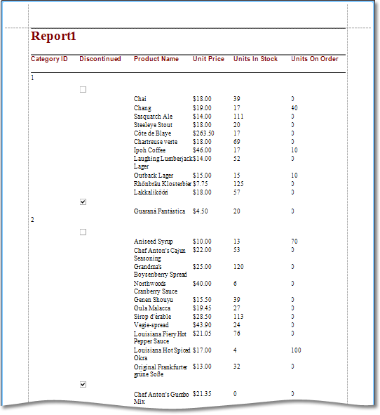

# Add Grouping Levels
This page allows you to group data in your report. If you do not need to group your data, simply click **Next** on this page to skip this step.

Nested grouping and grouping against multiple fields are fully supported. The following image illustrates all basic grouping types.

The list on the left-hand side displays data fields that can be used to group data. To apply grouping, do one of the following.
* Select columns and click the right arrow button.
* Double-click columns.

To remove a grouping field, double-click it in the list on the right-hand side, or select it and click the left arrow button. You can also change the order of grouping fields using the up arrow and down arrow buttons.

You can stop the wizard on this step by clicking **Finish**. In this case, your report will look similar to the image below.

If you want to customize your report further, click **Next**. If data grouping has been applied on this page, you will proceed to the [Specify Summary Options](specify-summary-options.md) page. If you have not grouped your data, you will skip the summaries step and go to the [Choose a Report Layout](choose-a-report-layout.md) page.