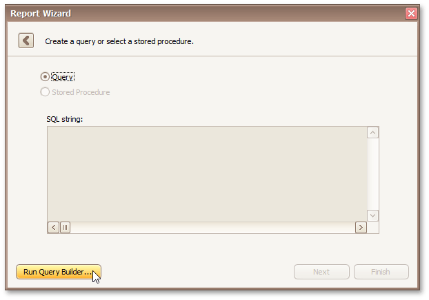
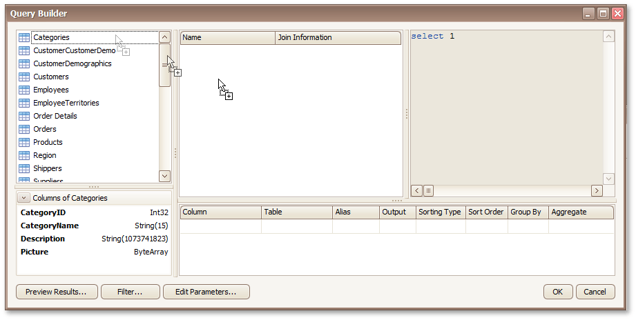
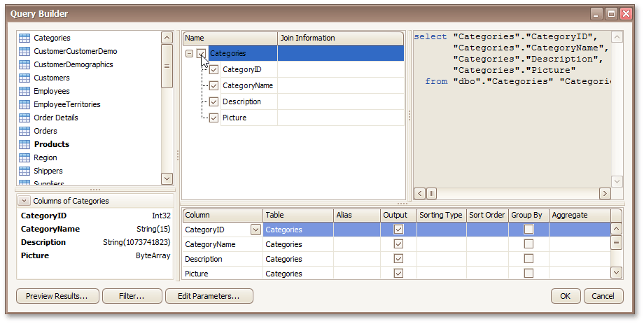
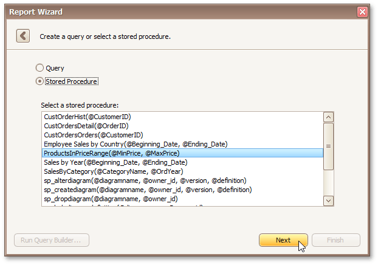

# Create a Query or Select a Stored Procedure (Single-Query Wizard Version)
> [!NOTE]
> This wizard step appears only if you are creating a new report from scratch and your software provider switched the Report Wizard to single-query mode.

On this page, you can construct a SQL query to obtain data from the database or select a stored procedure.
* [Query](#query)
* [Stored Procedure](#storedprocedure)

## <a name="query"/>Query
To construct a SQL query, do the following.
1. Select the **Query** option and click the **Run Query Builder...** button.
	
	
2. In the invoked [Query Builder](../../../report-designer-reference/report-designer-ui/query-builder.md) window, select an item from the list of available tables on the left and drop it onto the list of data tables to be used.
	
	
3. Enable the check box near the added table to include all of its fields in the data view.
	
	
	
	To assign a custom name to the selected data column, specify its **Alias** in the column list displayed under the data source editor. You can also apply sorting, grouping, filtering and aggregate functions to incoming data.
	
	Click **OK** to exit the **Query Builder**

## <a name="storedprocedure"/>Stored Procedure
To use a stored procedure, choose the second option and select a stored procedure from the list of the available stored procedures.

If the constructed query or selected stored procedure contains any parameters, you will be required to define their values on the next wizard page: [Configure Query Parameters](configure-query-parameters.md).

Otherwise, clicking **Next** will open the next Report Wizard page: [Choose Columns to Display in Your Report](../choose-columns-to-display-in-your-report.md).