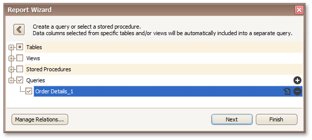
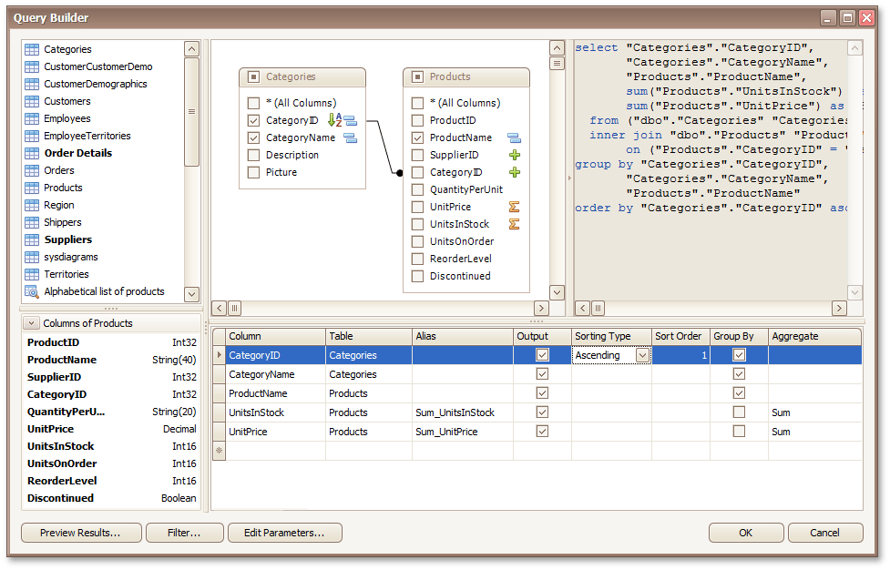
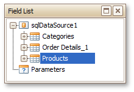
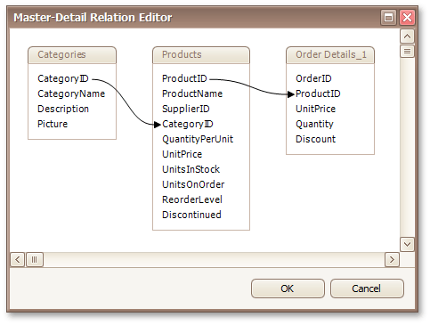
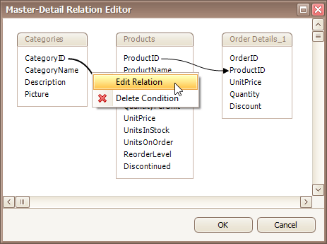
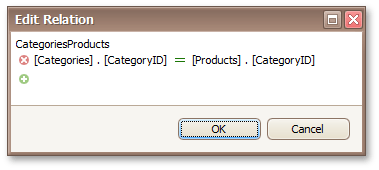

# Create a Query or Select a Stored Procedure
> [!NOTE]
> This wizard step appears only if you're creating a new report from scratch. In this instance, familiarity with database connections is required, so we recommend that you contact your application administrator or vendor for assistance. If you're modifying an existing report, this step will not appear and you will start with the [Choose Columns to Display in Your Report](../choose-columns-to-display-in-your-report.md) wizard page.
> 
> If your software vendor switched the Report Wizard to single-query mode, [another version](create-a-query-or-select-a-stored-procedure-2.md) of this page is displayed.

On this wizard page, you can choose which tables, views and/or stored procedures from your data source to display in the report.

## Manage Custom Queries
When you are required to shape the query data at the level of a data source, you can create custom queries by expanding the **Queries** category and clicking the  button. This will invoke the [Query Builder](../../../report-designer-reference/report-designer-ui/query-builder.md) where you can create complex queries by joining multiple tables, filtering, sorting and grouping their data, as well as calculating various aggregate functions.

The Query Builder can also be used to specify custom SQL, if this functionality is enabled by your software provider.

To customize an existing query using the Query Builder, click the  button.

To delete a query, click the  button.

On finishing the wizard, each of the selected data items will be included into a separate query.

## Specify Master-Detail Relationships
To define [master-detail relationships](../../../create-reports/report-types/master-detail-report-(detail-report-bands).md) between two or more queries, click **Manage Relations**.

To create a new relationship, connect the required key fields using drag and drop.

To edit an existing relationship, double-click the corresponding arrow or right-click it, and select the **Edit Relation** command in the invoked context menu.

This will invoke the **Edit Relation** editor that provides a different UI to manage the data relationships.

On finishing the wizard, the specified data relationships will appear in the [Field List](../../../report-designer-reference/report-designer-ui/field-list.md).

If selected queries or stored procedures contain any [parameters](../../../report-editing-basics/use-query-parameters.md), you will be required to define their values on the next wizard page: [Configure Query Parameters](configure-query-parameters.md).

Otherwise, clicking **Next** will open the next Report Wizard page: [Choose Columns to Display in Your Report](../choose-columns-to-display-in-your-report.md).