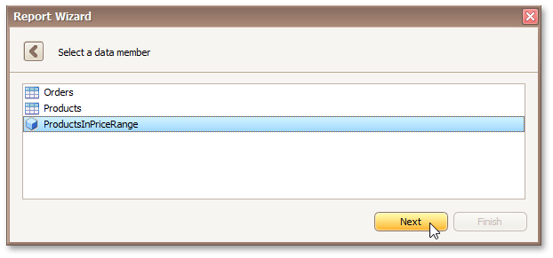

> This wizard step appears only if you're creating a new report from scratch. If you're modifying an existing report, this step will not appear and you will start with the [Choose Columns to Display in Your Report](../../../../../../../interface-elements-for-desktop/articles/report-designer/report-designer-for-winforms/report-wizard/data-bound-report/choose-columns-to-display-in-your-report.md) wizard page.

On this page, select the required data member from the list of available data members.

Click **Next** to proceed to the next wizard page: [Choose Columns to Display in Your Report](../../../../../../../interface-elements-for-desktop/articles/report-designer/report-designer-for-winforms/report-wizard/data-bound-report/choose-columns-to-display-in-your-report.md).