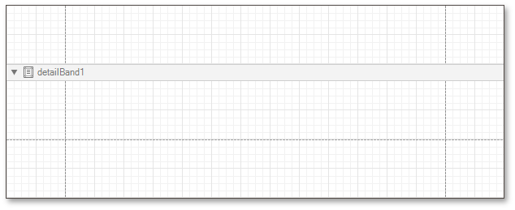

# Empty Report
Select the **Empty Report** option on the [Choose a Report Type](../../../../../interface-elements-for-desktop/articles/report-designer/report-designer-for-winforms/report-wizard/choose-a-report-type.md) wizard page to create a new blank report that is not bound to any data source.

The following image illustrates the default layout of a newly added empty report.

You can then bind the report to a required data source and construct the report layout.