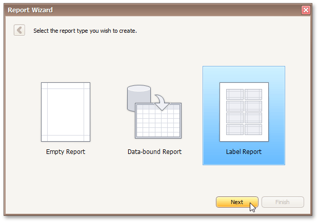

# Label Report
This topic describes the steps required to create a **Label Report** using the [Report Wizard](data-bound-report.md).

Label report creation consists of the following two steps.
* [Select a Label Type](label-report/select-a-label-type.md)
* [Customize Label Options](label-report/customize-label-options.md)

After completing the Label Report wizard, you will get a blank report that generates labels of a particular size. The report designer will indicate the label boundaries and properly position labels on paper sheets. You can then populate the label area with the required content and print out your labels.