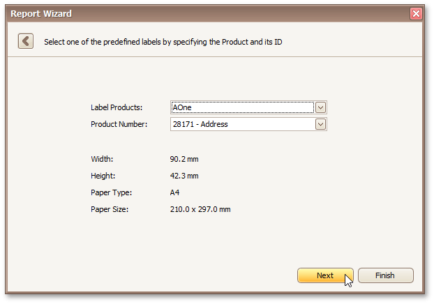

# Select a Label Type
This page is intended to select a label type from numerous predefined types.

On this page, you can choose the proper settings from the **Label Products** and the **Product Number** drop-down lists. The selected type defines the label's size and layout, as well as the page type, which is default for this label.

If you do not need further customization, click **Finish** to complete the report adjustment. If manual correction of label or paper size is required, click **Next** to proceed to the next page: [Customize Label Options](customize-label-options.md).