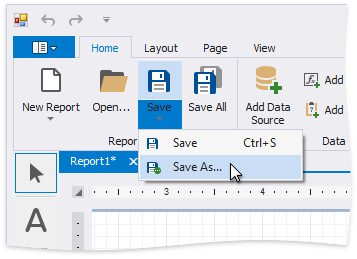
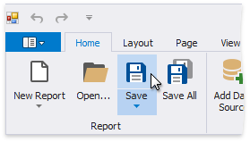
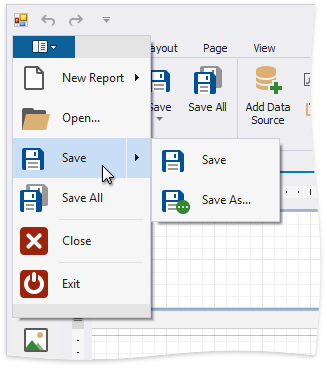

# Save Reports

Reports are saved as a file with an REPX extension. This file stores information about the report layout.

You can use one of the following commands to save reports:

## Use the Ribbon's Home Tab

* Click **Save**| **Save As** to save a copy of the report.
	
	
	
	Specify the folder and file name in the invoked **Save As** dialog.

* Click **Save** or press CTRL+S to save the report's layout in the application's folder.
	
	

## Use the Ribbon Application Menu

You can use the **Save** or **Save As** command in the application's menu to save the report's current layout or save a copy of the report.

