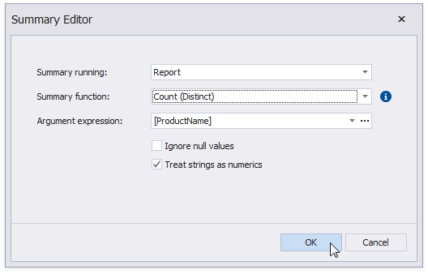
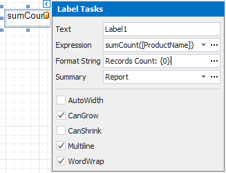
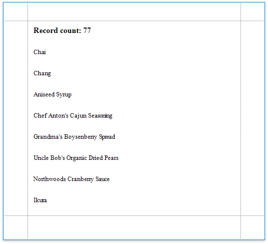

# Count the Number of Records in a Report or Group

This document describes how to display the number or records in a report or group.

1. Right-click the report's design surface and add a Report Header or Footer to display the record count for the entire report.
	
	
	
	> [!Note]
	> Use a Group Header/Footer for displaying record counts for groups, and a Page Header/Footer for displaying record counts for pages.

2. Switch to the [Field List](../../report-designer-tools/ui-panels/field-list.md) and drop the corresponding data table field onto the created band to create a data-bound label.
	
	

3. Click the label's smart tag. In the invoked Label Tasks window, click the **Summary** field's ellipsis button.
	
	

4. In the **Summary Editor** window:

	* Set the **Summary** property. Select **Report** to count the records throughout the entire report, or select **Group** or **Page** to reset the record count for every group or page.
	* Set the **Summary function** property to **DCount**.
	* Set the **Argument Expression** property to the data field you need to count.

	

6. Back in the **Label Tasks** window, you can use the **Format String** property to format the resulting value:
	
	

You can switch to [Print Preview](../../preview-print-and-export-reports.md) to see the resulting report.

