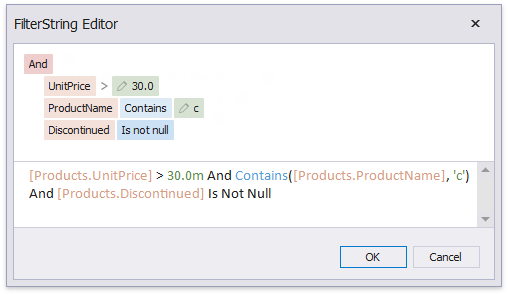

# Filter Data at the Data Source Level

This tutorial illustrates how to filter data at the report data source level, as opposed to the [report level](filter-data-at-the-report-level.md). This approach is recommended when dealing with comparatively large data sources when the retrieval process is slow.

1. [Create a new report](../../add-new-reports.md) or open an existing one.

2. Bind you report to a required data source. See the [Bind to Data](../../bind-to-data.md) section to learn more about providing data to reports.

3. Switch to the [Field List](../../report-designer-tools/ui-panels/field-list.md) and drop the required fields onto the report's [Detail](../../introduction-to-banded-reports.md) band.

    

4. Select the data source in the [Report Explorer](../../report-designer-tools/ui-panels/report-explorer.md), expand its **Queries** collection property in the [Property Grid](../../report-designer-tools/ui-panels/property-grid.md) and click the ellipsis for the **Filter String** property of the required query.

    

5. In the invoked [Filter Editor](../../../../filter-editor.md), construct an expression where the data fields are compared with the required values as shown below.

    

    Every filter condition consists of three parts:
    * A data field name.
    * Criteria operator, such as **Equals**, **Is less than**, **Is between**, etc.
    * A static operand value, another data field or a query parameter. See the [Use Query Parameters](../use-report-parameters/use-query-parameters.md) topic to learn about embedding these parameters into filter conditions.

    You can arrange specific conditions into groups with **And**, **Or**, **Not And**, and **Not Or** operators.

    Alternatively, you can specify a filter expression when creating a query using the [Query Builder](../../report-designer-tools/query-builder.md). To invoke the **Filter Editor** at this stage, click the **Filter...** button.

Switch to [Print Preview](../../preview-print-and-export-reports.md) to see the result.

