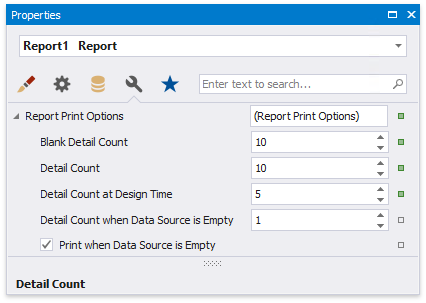
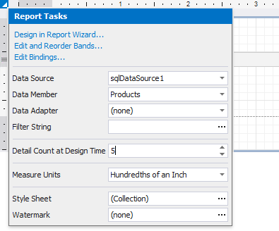

# Limit the Number of Records to Display

You can filter records displayed in [Print Preview](../../preview-print-and-export-reports.md) using **Report Print Options**. You can specify them in the [Property Grid](../../report-designer-tools/ui-panels/property-grid.md).

## **Limit the Number of Records**

The **Detail Count at Design Time** property enables you to limit the number of records a report shows in Print Preview embedded into the Report Designer. This option is also available in the report's smart tag.

Use the **Detail Count** option to define how many times to print the Detail band when generating a report document to display in Print Preview.

## **Print on Empty Data Source**

Disable the **Print when Data Source is Empty** option to avoid generating a report when its data source is empty. You can use this setting in [master-detail reports](../../create-popular-reports/create-a-master-detail-report-use-detail-report-bands.md) to hide the detail report if its data source contains no records.

The **Detail Count when Data Source is Empty** property allows you to specify how many times to print the Detail band when a report does not have a data source. You can use this property to create static reports that are not connected to a data source and display the same static content several times.
