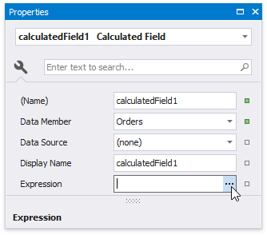

# Group Data by a Custom Field

This tutorial illustrates how to group a report against a custom criteria, in particular, group data by days of the week. 

1. Create a new or open an existing data-bound report.
	
	You cannot apply grouping unless your report is bound to a data source.

2. Create a [calculated field](../use-calculated-fields.md). Switch to the [Field List](../../report-designer-tools/ui-panels/field-list.md), right-click any item inside the data source and select **Add Calculated Field**.
	
		

3. Select the calculated field, and in the [Property Grid](../../report-designer-tools/ui-panels/property-grid.md), click the **Expression** property's ellipsis button.
	
	
	

4. In the invoked **Expression Editor**, select the required date-time function and define the data field's name in **[**square brackets**]**. For example,  use the **GetDayOfWeek([OrderDate])** function to return a zero-based index of the day of the week, extracted from the **OrderDate** data field.
	
	
	
	Click **OK** to close the editor and save the changes.
5. Use the [Group and Sort](../../report-designer-tools/ui-panels/group-and-sort-panel.md) panel to quickly create a [Group Header](../../introduction-to-banded-reports.md) band associated with the calculated field.
	
	To create a group criteria, click **Add a Group** and select the calculated field from the invoked drop-down menu.
	
	
	
	You can also use this panel to specify whether or not the corresponding Group Footer band should be visible. The **Sort Order** drop-down list allows you to define the sort order within the group (ascending or descending) or disable sorting in grouped data.

6. Switch to the **Field List** and drop the required data fields onto the report's area.

    

7. Click the smart tag of the label in the Group Header and set the **Format String** property to **{0:dddd}**. This makes the label only display the day of the week, and not the date.
	
	

Switch to [Print Preview](../../preview-print-and-export-reports.md) to see the result.

