# Group Data

## Group a Report's Data
Do the following to group data in your report:

1. Create a new or open an existing data-bound report.
	
	You cannot apply grouping unless your report is bound to a data source.
2. Switch to the [Group and Sort](../../report-designer-tools/ui-panels/group-and-sort-panel.md) panel, click **Add a Group** and select the required data field in the invoked drop-down menu.
	
	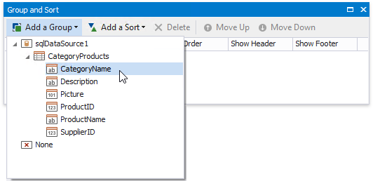
	
	> [!Note]
	> See the [Group Data by a Custom Field](group-data-by-a-custom-field.md) tutorial to learn how to group a report's data by a custom field.
	
	This creates an empty [Group Header](../../introduction-to-banded-reports.md) with a corresponding group field added to its **Group Fields** collection. You can access this collection by clicking the Group Header's smart tag.
	
	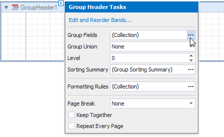
	
	You can use the **Group Field Collection Editor** to group data by multiple criteria. Click **Add** to create a new group field and specify its **Field Name** property.
	
	Use the up and down arrow buttons to specify the order in which these criteria are applied to the report's data.
	
	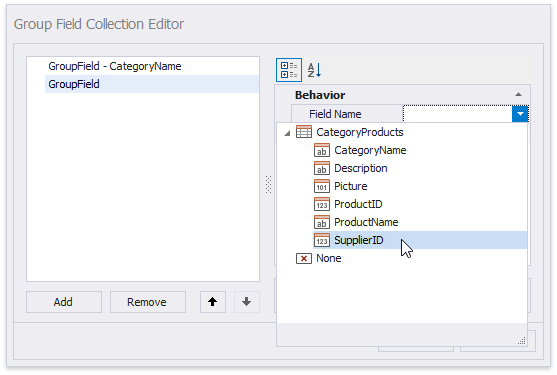

3. Back in the **Group and Sort** panel, you can specify the group fields' sorting order (ascending or descending).
	
	Select **None** if your groups are already ordered in the data source, and you do not need to sort them in the report.
	
	
	

4. Click **Show Footer** to create an empty footer for this group.
	
	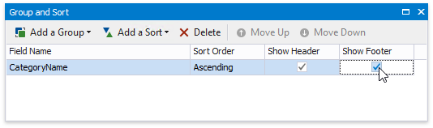
	
5. When a report has multiple groups, you can change their order by clicking **Move Up** or **Move Down**.
	
	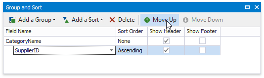
	
	The following images illustrate how a report looks when it is grouped by multiple criteria:
	
	| A single group with multiple group fields | Nested group header bands |
	|---|---|
	| 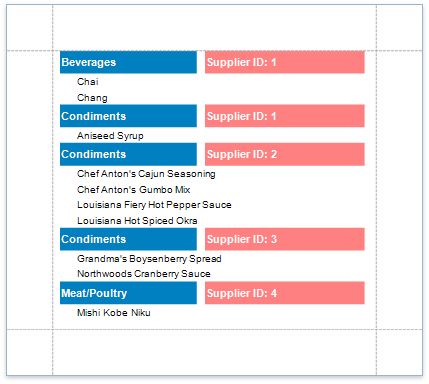 | 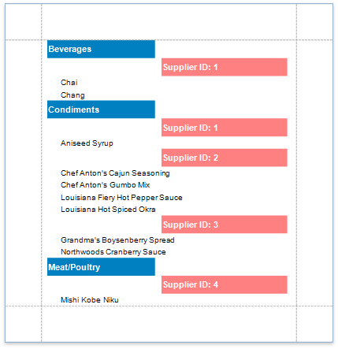 |

6. Drag the corresponding field from the [Field List](../../report-designer-tools/ui-panels/field-list.md) and drop it onto the group footer to display the group field's value in the report.
	
	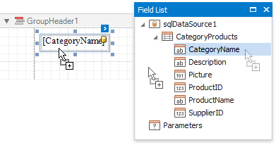

The resulting report looks as follows:

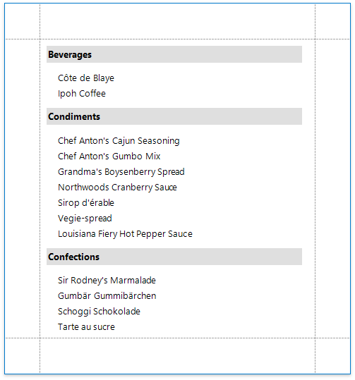

## Specify the Group's Settings
You can use the group band's smart tag to customize the group's layout settings:

* Use the **Group Union** property to keep a group's content on the same page when possible.
	
	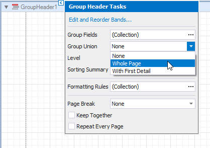

* Use the **Keep Together** property to print the Group Header/Footer on the same page as the group's contents.
	
	

* Use the **Repeat Every Page** property to print the group band on each page.
	
	

* Use the **Page Break** property to start a new page before or after each group.
	
	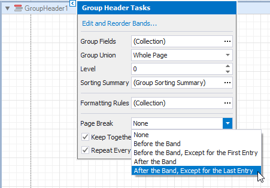

When you need to display page numbers for individual groups, add the [Page Info](../../use-report-elements/use-basic-report-controls/page-info.md) control to the Group Header or Footer and set its **Running Band** property to the Group Header's name.
	
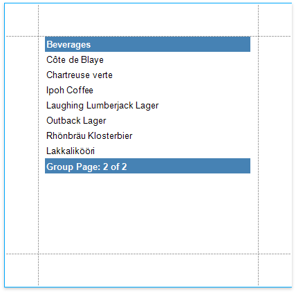
	
Accurate page numbering requires that different groups do not appear on the same page. For this reason, you need to set the Group Header's **Page Break** property to **After Band**, or place the **Page Break** control at the band's bottom.
	
