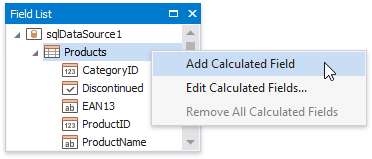
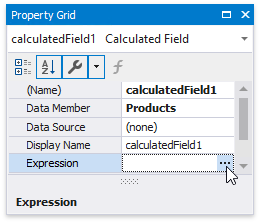
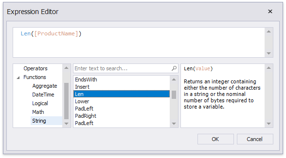
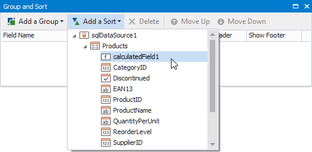
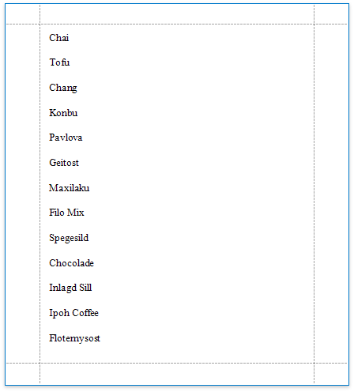

# Sort Data by a Custom Field

This tutorial illustrates how to sort a report against a custom criteria, in particular, sort data by the number of characters in the data field value. 

1. Create a new or open an existing data-bound report.
	
	You cannot apply grouping unless your report is bound to a data source.

2. Create a [calculated field](../use-calculated-fields.md). Switch to the [Field List](../../report-designer-tools/ui-panels/field-list.md), right-click any item inside the data source and select **Add Calculated Field**.
	
		

3. Select the calculated field, and in the [Property Grid](../../report-designer-tools/ui-panels/property-grid.md), click the **Expression** property's ellipsis button.
	
	
	

4. In the invoked **Expression Editor**, select the required date-time function and define the data field's name in **[**square brackets**]**. For example,  use the **Len([ProductName])** function to return the number of characters extracted from the **ProductName** data field.
	
	
	
	Click **OK** to close the editor and save the changes.
5. In the [Group and Sort](../../report-designer-tools/ui-panels/group-and-sort-panel.md) panel, click **Add a Sort** and select the calculated field from the invoked drop-down menu.
	
	
	
	The **Sort Order** drop-down list allows you to define the sort order within the group (ascending or descending).

6. Drag the corresponding field from the [Field List](../../report-designer-tools/ui-panels/field-list.md) onto the report area and switch to [Print Preview](../../preview-print-and-export-reports.md) to see the result.

    