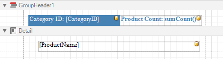

# Sort Groups by a Summary Function's Result

This tutorial explains how to sort groups by a summary function result, in particular, by the number of records groups contain.

1. Create a new or open an existing data-bound report.
	
	You cannot apply grouping unless your report is bound to a data source.
2. [Group the report](group-data.md) by the required data field, [calculate the record count](../shape-data-expression-bindings/calculate-a-summary.md) in each group and construct the required report layout.

    

3. Click the Group Header band's smart tag, and click the **Sorting Summary** property's ellipsis button.
	
	In the invoked **Group Sorting Summary Editor**, turn on the **Enabled** option, set the **Field** option to the data field from the Detail band, and set the **Summary function** to **Count**.
	
	
	
	In this editor, you can also define the sorting direction for the group, as well as specify whether or not the **Null** values should be ignored.
	
	Click **OK** to apply the changes and close the dialog.

Switch to [Print Preview](../../preview-print-and-export-reports.md) to see the result.

