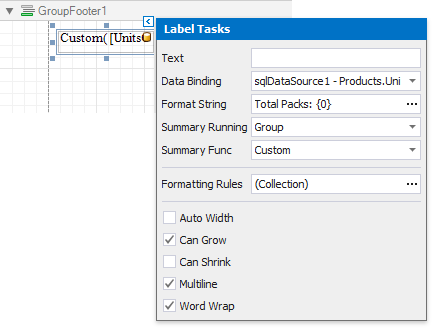
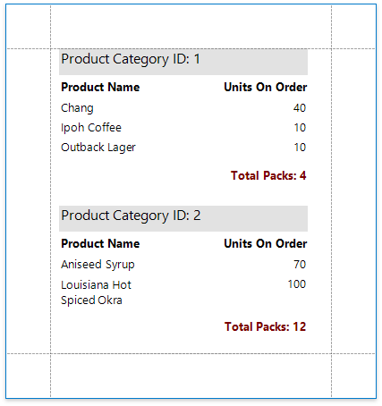

# Calculate a Custom Summary

This tutorial describes the steps required to calculate a custom summary that is not one of the built-in summary functions.

> [!Warning]
> Use the approach below if expression bindings **are not enabled** in the Report Designer (the [Property Grid](../../report-designer-tools/ui-panels/property-grid.md) does not provide the **Expressions**  tab ).
>
> See [Calculate an Advanced Summary](../shape-data-expression-bindings/calculate-an-advanced-summary.md) if expression bindings **are enabled** in the Report Designer (the [Property Grid](../../report-designer-tools/ui-panels/property-grid.md) provides the **Expressions**  tab).

1. [Create a new report](../../add-new-reports.md) or open an existing one and [bind it to a data source](../../bind-to-data.md).

2. Switch to the [Group and Sort](../../report-designer-tools/ui-panels/group-and-sort-panel.md) panel and group the report's data by the required field. Display the footer for the created group.

    

3. Drop a required data field onto the group footer to display the summary result. Click the label's smart tag and set its **Summary Running** property to **Group**. Set the **Summary Func** property to **Custom** and use the **Format String** property to format the summary's value.

    

4. When selecting the **Custom** option, three more events are added to the label's **Scripts** list: **Summary Get Result**, **Summary Reset** and **Summary Row Changed**.

    

    You can handle these events in the following way using the [Script Editor](../../use-report-scripts.md).

    **C#**

    ```csharp

    // Declare a summary and a pack.
    double totalUnits = 0;
    double pack = 15;

    private void OnSummaryReset(object sender, System.EventArgs e) {
        // Reset the result each time a group is printed.
        totalUnits = 0;
    }

    private void OnSummaryRowChanged(object sender, System.EventArgs e) {
        // Calculate a summary.
        totalUnits += Convert.ToDouble(GetCurrentColumnValue("UnitsOnOrder"));
    }

    private void OnSummaryGetResult(object sender, 
    DevExpress.XtraReports.UI.SummaryGetResultEventArgs e) {
        // Round the result, so that a pack will be taken into account 
        // even if it contains only one unit.
        e.Result = Math.Ceiling(totalUnits / pack);
        e.Handled = true;
    }

    ```
    **VB.NET**

    ```vb

    ' Declare a summary and a pack.
    Private totalUnits As Double = 0
    Private pack As Double = 15

    Private Sub OnSummaryReset(ByVal sender As Object, ByVal e As System.EventArgs)
        ' Reset the result each time a group is printed.
        totalUnits = 0
    End Sub

    Private Sub OnSummaryRowChanged(ByVal sender As Object, ByVal e As System.EventArgs)
        ' Calculate a summary.
        totalUnits += Convert.ToDouble(GetCurrentColumnValue("UnitsOnOrder"))
    End Sub

    Private Sub OnSummaryGetResult(ByVal sender As Object,  _ 
    ByVal e As DevExpress.XtraReports.UI.SummaryGetResultEventArgs)
        ' Round the result, so that a pack will be taken into account 
        ' even if it contains only one unit.
        e.Result = Math.Ceiling(totalUnits / pack)
        e.Handled = True
    End Sub

    ```

Switch to [Print Preview](../../preview-print-and-export-reports.md) to see the result.

