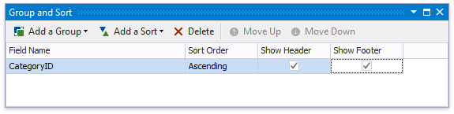

# Calculate a Summary

This tutorial describes the steps required to calculate one of the built-in summary functions in your report.

> [!Warning]
> Use the approach below if expression bindings **are not enabled** in the Report Designer (the [Property Grid](../../report-designer-tools/ui-panels/property-grid.md) does not provide the **Expressions**  tab ).
>
> See [Calculate a Summary](../shape-data-expression-bindings/calculate-a-summary.md) if expression bindings **are enabled** in the Report Designer (the [Property Grid](../../report-designer-tools/ui-panels/property-grid.md) provides the **Expressions**  tab).

1. [Create a new report](../../add-new-reports.md) or open an existing one and [bind it to a data source](../../bind-to-data.md).

2. Switch to the [Group and Sort](../../report-designer-tools/ui-panels/group-and-sort-panel.md) panel and group the report's data by the required field. Display the footer for the created group.

    

3. Prepare the report layout and drop a required data field onto the group footer to display the summary result.

4. Click the label's smart tag and invoke its **Summary Running** drop-down list. Select the range for which to calculate a summary (the entire report, a specific report group or document page).
	
	

5. Set the **Summary Func** property to **Sum** and use the **Format String** property to format the summary's value.

	
	

Switch to [Print Preview](../../preview-print-and-export-reports.md) to see the result.

