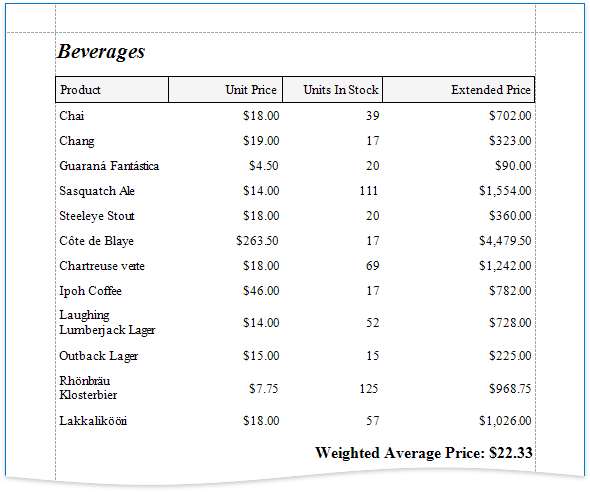

# Calculate a Weighted Average

> [!NOTE]
> You can use this approach if data bindings **are enabled** in the Report Designer (the [Property Grid](../../report-designer-tools/ui-panels/property-grid.md) does not provide the **Expressions**  tab).
>
> See the next document sections to learn about alternative approaches.

Use one of the following approaches to calculate weighted average data:

## Aggregate Functions

You can create a [calculated field](../use-calculated-fields/calculated-fields-overview.md) and use a standard aggregate function in its expression to evaluate a weighted average at the report level.

1. [Open an existing report](../../open-reports.md) or [create a new one from scratch](../../add-new-reports.md).
2. [Bind a report](../../bind-to-data.md) to a required data source.
3. Right-click any item in the [Field List](../../../../../articles/report-designer/report-designer-for-winforms/report-designer-tools/ui-panels/field-list.md)'s data source node, and in the invoked context menu, select **Add Calculated Field**.

	

4. Select the created calculated field and switch to the **Properties** window. Specify the **Name** property, set the **Field Type** to Decimal and click the Expression property's ellipsis button.

	

5. In the invoked Expression Editor, specify an aggregate expression:

    

    To construct a valid aggregate expression, use the following format:

    [&lt;Collection>][&lt;Condition>].&lt;Aggregate>(&lt;Expression>)

    * &lt;Collection> - Specifies a collection to calculate an aggregated value against. It can be the relationship name for a master-detail relationship, or a collection property's name exposed by the target class. For example, [CategoriesProducts][[CategoryId]>5].Count(). Empty brackets [] indicate the root collection.
    * &lt;Condition> - Specifies a condition that defines which records to use for the aggregate function calculation. To calculate an aggregated value against all records, delete this logical clause and its square brackets (for example, [].Count()).
    * &lt;Aggregate> - Specifies one of the available aggregate functions listed in the Aggregate enumeration.
    * &lt;Expression> - Specifies the expression to use. For example, [][[CategoryID] > 5].Sum([UnitPrice]*[Quantity]). The Count function does not require field values to count the records (the round brackets can be empty for this function).

    Use the Parent Relationship Traversal Operator ('^') to refer to the processed group (for instance, [][[^.CategoryID] == [CategoryID]].Sum([UnitPrice])). This allows you to calculate aggregates within groups.

    For more information, see [Expression Constants, Operators, and Functions](../../../../../articles/expression-editor/expression-operators-functions-and-constants.md).

6. Add the created calculated field to the report as an ordinary data field and format its value.

## Data Source Level

Use a **sqlDataSource** component to calculate summaries at data source level. You can use these summaries as regular data fields in your report. Then, create a [calculated field](../use-calculated-fields/calculated-fields-overview.md) where your expression uses these fields.

1. When you use the [Report Wizard](../../../../../articles/report-designer/report-designer-for-winforms/report-designer-tools/report-wizard.md) or [bind a report to an SQL data source](../../../../../articles/report-designer/report-designer-for-winforms/bind-to-data/bind-a-report-to-a-database.md), go to the [query customization](../../../../../articles/report-designer/report-designer-for-winforms/report-designer-tools/data-source-wizard/connect-to-a-database/create-a-query-or-select-a-stored-procedure.md) page and click the  button for the **Queries** category. Then use the [Query Builder](../../../../../articles/report-designer/report-designer-for-winforms/report-designer-tools/query-builder.md) to create a new query.

	

	To customize a data source, right-click the data source in the [Report Explorer](../../../../../articles/report-designer/report-designer-for-winforms/report-designer-tools/ui-panels/report-explorer.md) or [Field List](../../../../../articles/report-designer/report-designer-for-winforms/report-designer-tools/ui-panels/field-list.md) and select **Manage Queries...** in the context menu.

	

	In the invoked **Manage Queries** dialog, click the query's ellipsis button.

	

	In the invoked editor page, click the **Run Query Builder** button.

	

2. In the **Query Builder**, add tables to the query. Enable the fields' checkboxes to include them in the query.

	

3. In the column list under the data source editor, group data by the **CategoryID** and **CategoryName** fields and apply the **Sum** aggregate function to the **UnitsInStock** field.

	

4. Click a new column's expression ellipsis button. In the invoked **Expression Editor**, specify an expression that multiplies the averaged field and the weight field as in the image below:

	

5. Apply the **Sum** aggregate function to the previously created column as well.

	The image below shows the created query.

	

6. Click **OK** to complete the **Query Builder**, then click **Finish** to exit the wizard.

7. Go to the [Field List](../../../../../articles/report-designer/report-designer-for-winforms/report-designer-tools/ui-panels/field-list.md), right-click any item inside the data source node. In the invoked context menu, select **Add Calculated Field**.

	

8. Right-click the created calculated field and select **Edit Expression**.

	

9. In the invoked **Expression Editor**, construct the expression and click **OK**:

	
10. Add the created calculated field to the report as an ordinary data field and format its value.