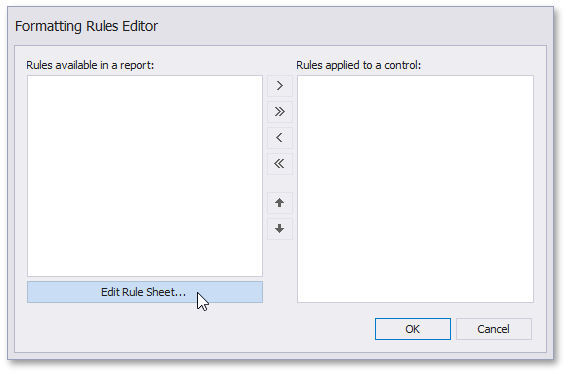
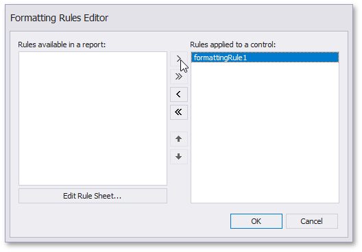
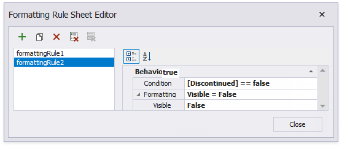

# Conditionally Change a Band's Visibility

This document describes how to change a report band's visibility.

The report created in this tutorial contains two Detail **sub-bands** with different report controls. These sub-bands are used to display discontinued and continued products. 

Follow the steps below to see how to change the sub-bands' visibility based on the **Product**'s **Discontinued** field value.

1. Bind your report to the Products table from the Northwind database.

2. Add two **Sub-bands** to the Detail band and drag the **XRLabel** from the **Toolbox** to the first sub-band and **XRTable** to the second sub-band.

	

	Bind **Label1** and **TableCell1** to the **ProductName** field. Add an **XRPictureBox** control to the **TableCell2** and specify its **ImageSource** property. This picture will serve as an indication of discontinued products.
	
	

3. Select the created **SubBand1** and click its smart tag. In the invoked actions list, click the ellipsis button for the **FormattingRules** property.
	
	
	
	In the invoked **Formatting Rules Editor**, click the **Edit Rule Sheet...** button.
	
	

4. In the invoked **Formatting Rule Sheet Editor**, click  to create a new formatting rule.
	
	- Set the FormattingRule.Condition property to **[Discontinued] == true**.
	
	- Set the **Visible** property to **false**.

	This means that the **Discontinued** data field should be **true** for the **SubBand1** to be hidden.

	
	

5. In the **Formatting Rules Editor**, move the created rule (named **formattingRule1**) to the list of active rules.
	
	
	

6. Do the same (the steps 3-5 above) with the **SubBand2**. Create a formatting rule.

	- Set the **Visible** property to **false**.
	- Set the **Condition** property to the **[Discontinued == false]** expression. 

	

	In the **Formatting Rules Editor**, move the created rule (named **formattingRule2**)  to the list of active rules.

	
	

As a result, the Print Preview displays how changes to band visibility influence the Product List. The **SubBand1** is used to display products that have the **Discontinuous** field set to false, and the **SubBand2** is used to display the discontinued products.

