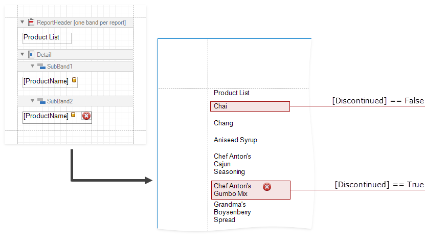
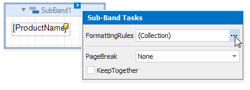
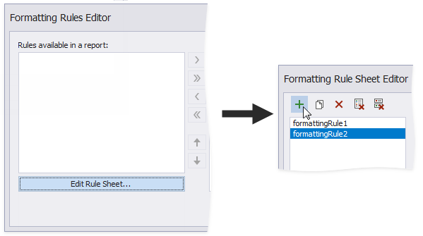
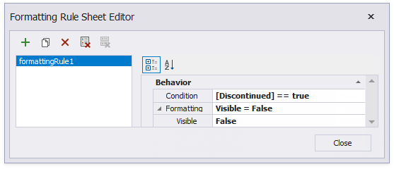
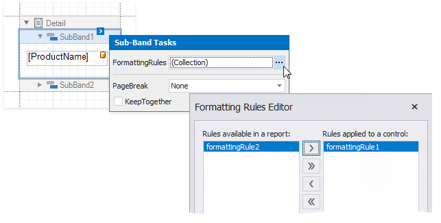
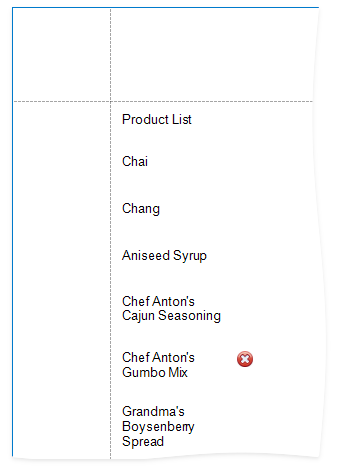

# Conditionally Change a Band's Visibility

This document describes how to change a report band's visibility.

The report created in this tutorial contains two Detail **sub-bands** with different report controls. These sub-bands are used to display discontinued and current products. 

The steps below demonstrate how to change a band's visibility based on a field's value.

1. Create formatting rule(s). 

	- Select a report and click its smart tag. In the invoked actions list, click the ellipsis button for the **FormattingRules** property.
	
		
	
	- In the invoked **Formatting Rules Editor**, click the **Edit Rule Sheet...** button. The button invokes the **Formatting Rule Sheet Editor**. Click  to create a new formatting rule.
	
		
		
		Here, two rules are added.

  	- Specify a condition for the rule. Click the ellipsis button for the rule's **Condition** property. In the invoked **Formatting Rules Editor**, specify the required expression.

		

	  Here, the **[Discontinued] == true** expression is set for the **formattingRule1**  and the **[Discontinued] == false** expression - for the **formattingRule2**. 
        
	- Specify the **Visible** property for the rule.

          

        Here, the **Visible** property is set to **False** for both rules.

	
2. Apply the rule(s) to the required band(s).
 	
	Invoke the **Formatting Rules Editor** for a selected a band and move a rule to the **Rules applied to a control** section.
	
	
	

	Here, the **formattingRule1** is applied to the **SubBand1**, and the **formattingRule2** - to the **SubBand2**.

The Print Preview displays how changes to band visibility influence the Product List. The **SubBand1** is used to display products that have the **Discontinuous** field set to false, and the **SubBand2** is used to display the discontinued products.

