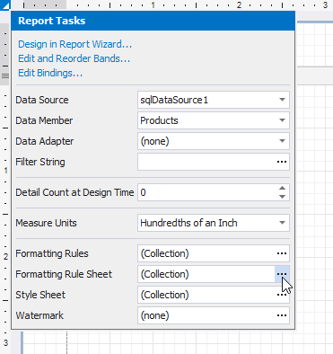
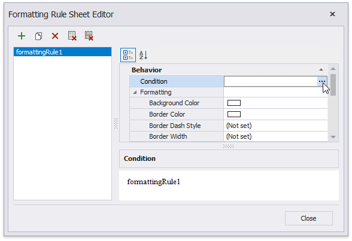
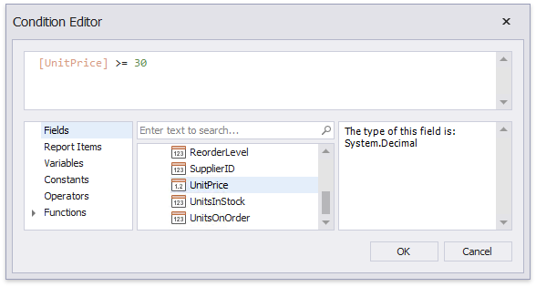
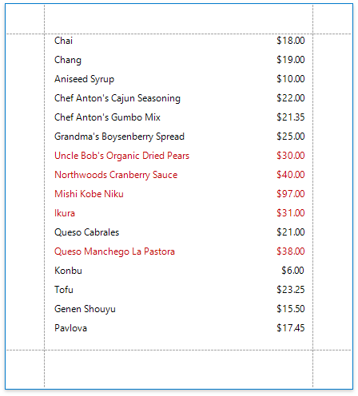

# Conditionally Change a Control's Appearance

This document describes how to change a report control's appearance based on a specific condition.

> [!NOTE]
> Use this approach if data bindings **are enabled** in the Report Designer (the Label's smart tag includes the **Data Binding** property).
>
> 
>
> See the [Conditionally Change a Control's Appearance](../shape-data-expression-bindings/conditionally-change-a-control-appearance.md) topic in the [Shape Data (Expression Bindings)](../shape-data-expression-bindings.md) section to learn about an alternative approach.

1. Click the report's smart tag, and in the invoked actions list, click the **Formatting Rule Sheet** property's ellipsis button.

    

2. In the invoked **Formatting Rule Sheet Editor**, click the plus button to create a new formatting rule and click the **Condition** property's ellipsis button.

	

3. In the invoked **Condition Editor**, specify the required Boolean condition (which means that its result is either _true_ or _false_).
	
		

	Click **OK** to save the changes and close the dialog.

4. Back in the **Formatting Rule Sheet Editor**, define the formatting to be applied (e.g. specify the desired font color).

    

    Click **Close** to save the changes and quit the dialog.

5. Select a required band or control to which the formatting rule should be applied and access its **Formatting Rules** collection.

    

6. In the invoked **Formatting Rules Editor**, move the rule to the list of active rules on the right using the arrow buttons in the center of the editor.

    

    In this editor, you can also customize the precedence of formatting rules using the up and down arrow buttons on the right of the dialog box. The rules are applied in the same order that they appear in the list, and the last rule in the list has the highest priority.

Switch to [Print Preview](../../preview-print-and-export-reports.md) to view the resulting report.

