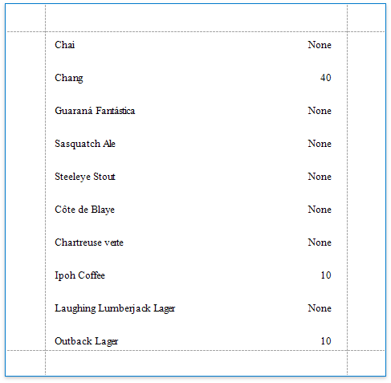

# Conditionally Change a Label's Text

This document describes how to display different values in a report control based on a specified logical condition.

> [!NOTE]
> Use this approach if data bindings **are enabled** in the Report Designer (the Label's smart tag includes the **Data Binding** property).
>
> 
>
> See the [Conditionally Change a Label's Text](../shape-data-expression-bindings/conditionally-change-a-label-text.md) topic in the [Shape Data (Expression Bindings)](../shape-data-expression-bindings.md) section to learn about an alternative approach.

1. [Create a new report](../../add-new-reports.md) or open an existing one and [bind it to a data source](../../bind-to-data.md).

2. Right-click any of the data fields in the [Field List](../../report-designer-tools/ui-panels/field-list.md) and select **Add Calculated Field**.

    

3. Switch to the [Property Grid](../../report-designer-tools/ui-panels/property-grid.md) and set the **Field Type** property to **String**. Then. click the  **Expression** property's ellipsis button.

    

4. In the invoked **Expression Editor**, define the required condition for the calculated field.

    

	Use the **Iif** function to define the condition. For example:
    
    **Iif([UnitsOnOrder] == 0, 'None', [UnitsOnOrder])**
	
	This expression means that if the data field's value is zero, the control's text is set to '**None**'; otherwise, it displays the actual field value.

5. Drop the required data fields and the created calculated field from the [Field List](../../report-designer-tools/ui-panels/field-list.md) on the report's Detail band.
	
	 

When switching to [Print Preview](../../preview-print-and-export-reports.md), you can see the report control displaying the assigned values.

