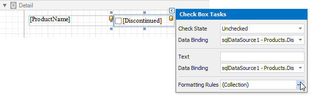
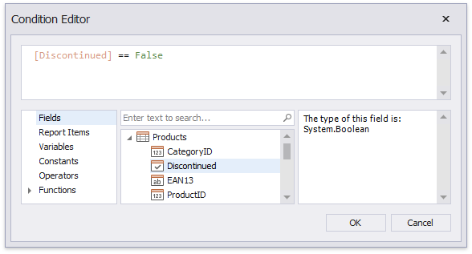

# Conditionally Suppress Controls

This document describes how to display or hide a report control in a published document based on a specified logical condition.

> [!NOTE]
> Use this approach if data bindings **are enabled** in the Report Designer (the Label's smart tag includes the **Data Binding** property).
>
> 
>
> See the [Conditionally Suppress Controls](../shape-data-expression-bindings/conditionally-supress-controls.md) topic in the [Shape Data (Expression Bindings)](../shape-data-expression-bindings.md) section to learn about an alternative approach.

1. [Create a new report](../../add-new-reports.md) or open an existing one and prepare the report layout.

2. Select the required control and click its smart tag. In the invoked actions list, click the **Formatting Rules** property's ellipsis button. 

    

3. In the invoked **Formatting Rules Editor**, click the **Edit Rule Sheet** button.

    

4. In the invoked **Formatting Rule Sheet Editor**, click the plus button to create a new formatting rule. Set the **Visible** property to **No** and click the **Condition** property's ellipsis button.

	

5. In the invoked **Condition Editor**, specify the required visibility condition.
	
	
	
	Click **OK** to save the changes and close the dialog. Then, click **Close** to quit the **Formatting Rule Sheet Editor**.

6. In the **Formatting Rules Editor**, you can see the created rule (called **formattingRule1**), which should be moved to the list of active rules on the right using the arrow buttons in the center of the dialog box.

	

	In this editor, you can also customize the precedence of formatting rules using the up and down arrow buttons on the right of the dialog box. The rules are applied in the same order that they appear in the list, and the last rule in the list has the highest priority.

When switching to [Print Preview](../../preview-print-and-export-reports.md), you can view the report control's visibility changes according to the assigned condition.

