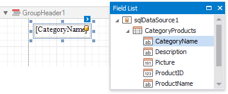

# Count the Number of Groups in a Report

This document describes how to count the number of groups in a report.

> [!NOTE]
> Use this approach if data bindings **are enabled** in the Report Designer (the Label's smart tag includes the **Data Binding** property).
>
> 
>
> See the [Count the Number of Groups in a Report](../shape-data-expression-bindings/count-the-number-of-groups-in-a-report.md) topic in the [Shape Data (Expression Bindings)](../shape-data-expression-bindings.md) section to learn about an alternative approach.

1. Switch to the [Group and Sort](../../report-designer-tools/ui-panels/group-and-sort-panel.md) panel and create a new group. Enable the **Show Header** option to display the Group Header in the report.
	
	

2. Switch to the [Field List](../../report-designer-tools/ui-panels/field-list.md) and drop the group field onto the created Group Header.
	
	

3. Right-click the report's surface and add a Report Footer to the report.
	
	

4. Drop the group field onto the Report Footer and invoke its smart tag. Set its **Summary Running** property to **Report**.
	
	

5. Set the **Summary Func** property to **Count (Distinct)** and use the **Format String** property to format the summary's value.
	
	

You can see the group count in the report footer when switching to [Print Preview](../../preview-print-and-export-reports.md).

